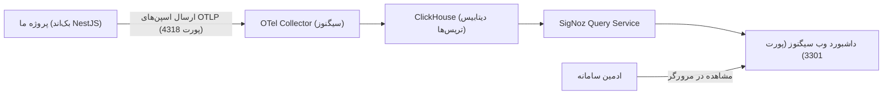

# راهنمای جامع و اختصاصی مانیتورینگ سیگنوز (SigNoz APM)

این مستند به طور کامل و با بیانی ساده و شفاف تشریح می‌کند که **سیگنوز دقیقاً چیست، چرا در حال حاضر اجرا (ران) نیست، در کد پروژه چه اقداماتی برای آن انجام شده، و چگونه می‌توانید با چند گام ساده آن را اجرا کرده و داده‌های زنده تله‌متری را مشاهده کنید.**

---

## ۱. پاسخ سریع به سوال مهم: «چرا سیگنوز الان ران نیست و نشون نمیده؟»

### دلیل فنی:
1. **سیگنوز یک پکیج نرم‌افزاری داخل فرانت‌اند یا بک‌اند نیست:**
   - سیگنوز یک سیستم مستقل زیرساختی (شبیه به پلتفرم‌های مانیتورینگ دیتاسنترها مثل Datadog یا Prometheus) است که خود از چندین کانتینر داکر مجزا (دیتابیس فوق‌سریع **ClickHouse**، کلکتور اوپن‌تله‌متری **OTel Collector**، موتور پردازش کوئری و داشبورد تحت وب) تشکیل شده است.
2. **عدم وجود کانتینرهای سیگنوز در داکر سیستم:**
   - با بررسی کانتینرهای فعال داکر سیستم شما (`docker ps -a`) مشخص شد که در حال حاضر صرفاً کانتینرهای دیتابیس اصلی پروژه یعنی **PostgreSQL** و فضای ذخیره‌سازی **MinIO** در حال اجرا هستند:
   ```text
   CONTAINER ID   IMAGE                STATUS         PORTS
   77d4792aec90   minio/minio:latest   Up 5 hours     9000-9001 (MinIO Storage)
   4db906b94c8a   postgres:16-alpine   Up 5 hours     5432 (Database)
   ```
   - کانتینرهای سیگنوز اصلاً روی داکر سیستم استارت نشده‌اند؛ در نتیجه هیچ برنامه‌ای روی پورت **۳۳۰۱** (داشبورد) یا پورت **۴۳۱۸** (کلکتور دریافت لاگ و تریس) گوش نمی‌دهد.
   - بنابراین وقتی روی دکمه «داشبورد SigNoz» در پنل ادمین کلیک می‌کنید یا آدرس `http://localhost:3301` را باز می‌کنید، مرورگر با خطای `Connection Refused` (عدم برقراری ارتباط) مواجه می‌شود.
3. **چرا از ابتدا سیگنوز را در داکر کامپوز اصلی نگذاشتیم؟**
   - سیستم سیگنوز و دیتابیس ClickHouse به حداقل **۴ الی ۸ گیگابایت حافظه رم** نیاز دارند.
   - اگر این ابزار به عنوان وابستگی اجباری در `docker-compose.yml` اصلی پروژه قرار می‌گرفت، کل سیستم کلاینت/سرور شما سنگین می‌شد و سرعت تست‌ها و توسعه به شدت افت می‌کرد. به همین دلیل در معماری استاندارد نرم‌افزاری، APM به صورت یک زیرساخت مجزا تعریف می‌شود.

---

## ۲. در کد پروژه دقیقاً چه اتفاقاتی افتاده و چه کارهایی انجام شده است؟

پروژه ما به صورت **۱۰۰٪ آماده برای اتصال به سیگنوز** برنامه‌نویسی شده است:

### الف) ماژول ارسال تله‌متری بومی (`backend/src/shared/telemetry.ts`)
- یک سرویس اختصاصی و استاندارد بر اساس پروتکل **OpenTelemetry OTLP HTTP** پیاده‌سازی شده است.
- این سرویس وظیفه دارد داده‌های تریس (Spans) را بسته‌بندی کرده و به کلکتور سیگنوز به آدرس زیر ارسال کند:
  ```http
  POST http://localhost:4318/v1/traces
  ```

### ب) ثبت هوشمند لاگ و تریس پردازش فایل‌ها (`file-processor.service.ts`)
- به محض اینکه کاربر یک فایل (PDF، اکسل، تصویر یا فایل متنی) ارسال می‌کند، ورکر پس‌زمینه یک Span تله‌متری با نام **`file.process`** ایجاد می‌کند و مشخصات زیر را درون آن ثبت می‌نماید:
  - **شناسه و نام فایل**: `file.id`, `file.original_name`
  - **کاربر ارسال‌کننده**: `file.user_id`
  - **حجم فایل به بایت**: `file.size_bytes`
  - **نوع فایل**: `file.type` (مانند `pdf`, `excel`, `image`, `text`)
  - **مدت زمان دقیق پردازش**: `process.duration_ms`
  - **وضعیت**: `ready` یا `error` همراه با پیام خطا و استک لاگ در صورت بروز مشکل.

### ج) طراحی ضد شکست و بدون کرش (Fail-Safe Architecture)
- یکی از مهم‌ترین اصول مهندسی در این پیاده‌سازی این است که:
  > **اگر سیگنوز خاموش باشد، سیستم چت و بک‌اند حتی یک ثانیه هم متوقف یا کُند نمی‌شود.**
- ارسال داده‌ها در یک بلاک پس‌زمینه با هندلینگ کامل خطا اجرا می‌شود؛ بنابراین چه سیگنوز روشن باشد و چه خاموش، کاربران با بالاترین سرعت چت می‌کنند و فایل‌هایشان بدون اشکال پردازش می‌شود.

### د) دکمه دسترسی سریع در پنل ادمین (`AdminPanelView.vue`)
- در تب «مدیریت فایل‌ها»، دکمه‌ای شیک با عنوان **«داشبورد SigNoz (مانیتورینگ تریس‌ها)»** قرار گرفته است که به محض روشن شدن سیگنوز، با یک کلیک صفحه مانیتورینگ (`http://localhost:3301`) را در تب مجزا باز می‌کند.

---

## ۳. معماری و اجزای سیگنوز به زبان ساده

سیگنوز از ۴ بخش اصلی تشکیل شده است:



1. **پورت ۴۳۱۸ (HTTP) / ۴۳۱۷ (gRPC)**: دروازه ورود اطلاعات؛ بک‌اند پروژه به این پورت داده می‌فرستد.
2. **ClickHouse**: پایگاه‌داده ستونی و قدرتمند که میلیون‌ها تریس را ذخیره می‌کند.
3. **پورت ۳۳۰۱**: رابط کاربری وب که ادمین با مرورگر باز می‌کند و نمودارهای زمان پاسخ‌گویی، تریس‌ها و خطاها را با فیلتر مشاهده می‌کند.

---

## ۴. چگونه سیگنوز را خیلی ساده و سریع ران (اجرا) کنیم؟

برای اجرای سیگنوز، **رسمی‌ترین و بی‌دردسرترین روش ارائه‌شده توسط تیم سازنده SigNoz** استفاده از مخزن آماده کانتینرهای آن است:

### مراحل اجرا در ترمینال سیستم (PowerShell یا CMD):

#### گام ۱: دانلود و کلون مخزن رسمی راه‌اندازی داکر سیگنوز
دستور زیر را در ترمینال اجرا کنید (ترجیحاً در مسیری مجزا خارج از کد پروژه یا در کنار آن):
```powershell
git clone -b main https://github.com/SigNoz/signoz.git
cd signoz/deploy
```

#### گام ۲: اجرای کانتینرهای سیگنوز با Docker Compose
با اجرای این دستور در همان پوشه، کانتینرهای سیگنوز دانلود و در پس‌زمینه اجرا می‌شوند:
```powershell
docker compose -f docker/clickhouse-setup/docker-compose.yaml up -d
```
*(بار اول حدود ۲ الی ۳ دقیقه برای دانلود ایمیج‌ها و استارت اولیه کلیک‌هاوس زمان می‌برد).*

#### گام ۳: بررسی وضعیت کانتینرها
با دستور زیر مطمئن شوید کانتینرهای `signoz-frontend` و `signoz-otel-collector` روشن (`Up`) هستند:
```powershell
docker ps
```

---

## ۵. مشاهده و راستی‌آزمایی تریس‌ها در داشبورد سیگنوز

1. مرورگر خود را باز کنید و وارد آدرس زیر شوید (یا در پنل ادمین روی دکمه سیگنوز کلیک کنید):
   ```text
   http://localhost:3301
   ```
2. در اولین ورود، صفحه ثبت‌نام ادمین سیگنوز نمایش داده می‌شود (یک ایمیل و رمز دلخواه وارد کنید).
3. از منوی سمت چپ وارد بخش **Traces** یا **Services** شوید.
4. در چت پروژه ما، یک فایل PDF یا عکس یا اکسل ارسال کنید.
5. به داشبورد سیگنوز بازگردید؛ مشاهده خواهید کرد که سرویس `codeless-backend` و عملیات `file.process` با تمام جزئیات (حجم فایل، زمان استخراج متن، وضعیت و متادیتا) با نمودارهای تفکیکی ثبت شده است!

---

## ۶. نحوه متوقف کردن یا حذف سیگنوز (در صورت نیاز به آزادسازی رم)

هر زمان که کار مانیتورینگ شما تمام شد و خواستید رم سیستم آزاد شود، در همان پوشه `signoz/deploy` دستور زیر را بزنید:
```powershell
docker compose -f docker/clickhouse-setup/docker-compose.yaml down
```
و پروژه اصلی بدون نیاز به سیگنوز به کار عادی خود ادامه خواهد داد.
