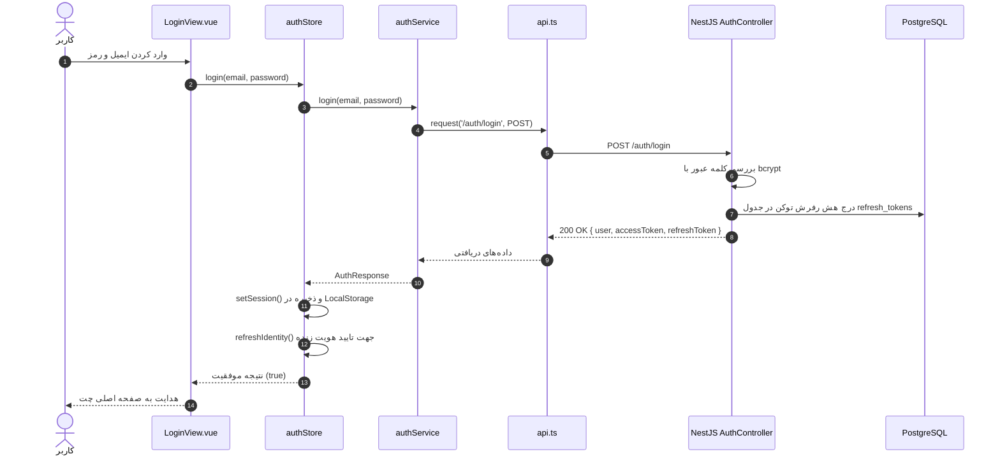
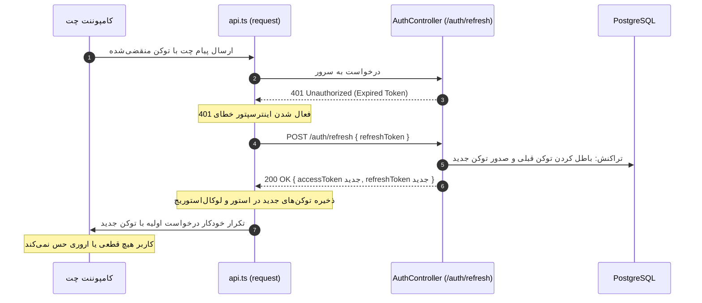
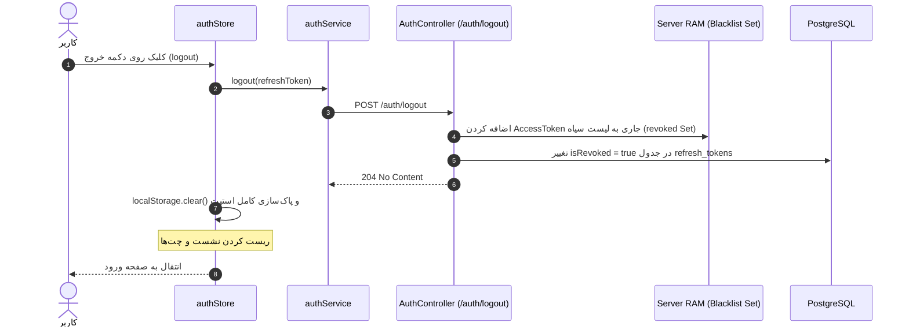

# راهنمای جامع و فنی سیستم احراز هویت (Authentication System Guide)

این مستند تشریح کامل و دقیق معماری، توابع، کامپوننت‌ها و جریان داده‌های سیستم احراز هویت پلتفرم در هر دو بخش **Backend** و **Frontend** را بر اساس پیاده‌سازی واقعی سورس‌کد ارائه می‌دهد.

---

## فهرست مطالب
1. [معماری کلی سیستم احراز هویت](#۱-معماری-کلی-سیستم-احراز-هویت)
2. [سیستم احراز هویت در بک‌اند (Backend)](#۲-سیستم-احراز-هویت-در-بک‌اند-backend)
   - [کنترلرها (Controllers)](#کنترلرها-controllers)
   - [سرویس‌ها (Services)](#سرویس‌ها-services)
   - [گاردها (Guards)](#گاردها-guards)
   - [موجودیت‌های پایگاه داده (Entities)](#موجودیت‌های-پایگاه-داده-entities)
3. [سیستم احراز هویت در فرانت‌اند (Frontend)](#۳-سیستم-احراز-هویت-در-فرانت‌اند-frontend)
   - [سرویس شبکه و رهگیری درخواست‌ها (API Client & Interceptor)](#سرویس-شبکه-و-رهگیری-درخواست‌ها-api-client--interceptor)
   - [سرویس‌های احراز هویت (Auth Services)](#سرویس‌های-احراز-هویت-auth-services)
   - [مدیریت وضعیت (Pinia Auth Store)](#مدیریت-وضعیت-pinia-auth-store)
   - [توابع کمکی و اعتبارسنجی توکن (JWT Utilities)](#توابع-کمکی-و-اعتبارسنجی-توکن-jwt-utilities)
   - [گاردهای مسیریابی (Router Navigation Guards)](#گاردهای-مسیریابی-router-navigation-guards)
4. [جریان‌های سرتاسری (End-to-End Execution Flows)](#۴-جریان‌های-سرتاسری-end-to-end-execution-flows)

---

## ۱. معماری کلی سیستم احراز هویت

سیستم احراز هویت بر پایه‌ی استاندارد **JSON Web Token (JWT)** به همراه استراتژی **توکن دوگانه (Dual-Token)** و مکانیزم امنیتی **چرخش رفرش توکن (Token Rotation)** بنا شده است:

```
[ Frontend: Vue 3 ]
       |
       | 1. HTTP Request + Header: Authorization: Bearer <AccessToken>
       v
[ Backend: NestJS JwtAuthGuard ]
       |
       +---> بررسی در Blacklist حافظه موقت (AuthService.isTokenRevoked)
       +---> اعتبارسنجی امضا و انقضای توکن (JwtService.verify)
       |
       v
[ AuthController / Protected Controllers ]
       |
       v
[ AuthService ] <---> [ PostgreSQL Database: TypeORM ]
```

### ویژگی‌های کلیدی امنیتی:
1. **Access Token کوتاه‌مدت**: با اعتبار زمانی ۱ ساعته جهت انجام کلیه عملیات روزمره در سیستم.
2. **Refresh Token ایمن**: رشته تصادفی و رمزنگاری‌شده با طول عمر ۷ روزه. مقدار خام آن هرگز در دیتابیس ذخیره نمی‌شود و تنها **هش SHA-256** آن در جدول پایگاه داده نگهداری می‌گردد.
3. **چرخش توکن (Token Rotation)**: در هر بار ارسال درخواست تمدید، توکن قدیمی فوراً ابطال (`isRevoked = true`) شده و جفت توکن جدید درون یک تراکنش اتمیک دیتابیس تولید می‌شود.
4. **بلک‌لیست درون‌حافظه‌ای (In-Memory Blacklist)**: هنگام خروج کاربر (Logout)، اکسس توکن جاری فوراً در یک ساختار داده `Set` در رم سرور قرار می‌گیرد تا امکان سوءاستفاده از آن به صفر برسد.
5. **تمدید خودکار و بی‌صدا (Silent Refresh)**: کلاینت فرانت‌اند به هنگام مواجهه با خطای `401 Unauthorized`، درخواست جاری را معلق کرده، توکن جدید را دریافت می‌کند و درخواست را مجدداً تکرار می‌نماید.

---

## ۲. سیستم احراز هویت در بک‌اند (Backend)

### کنترلرها (Controllers)

#### ۱. تابع `signup`
* **Function:** `signup`
* **File:** `auth.controller.ts`
* **Path:** `backend/src/modules/auth/auth.controller.ts`
* **Purpose:** ثبت‌نام کاربر جدید با استفاده از ایمیل، رمز عبور و نام نمایشی اختیاری.
* **Parameters:**
  * `d: SignupDto` (شامل فیلدهای `email`, `password`, `displayName`)
  * `req: any` (درخواست اکسپرس جهت خواندن IP و کلاینت)
* **Return:** `Promise<{ user: SafeUser, accessToken: string, refreshToken: string }>`
* **Called By:** ارسال درخواست کلاینت به اندپوینت
* **Calls:** `this.auth.signup(d.email, d.password, d.displayName, clientInfo)`
* **Used In:** فرآیند ثبت‌نام اولیه
* **Side Effects:** ثبت لاگ آی‌پی و هدر مرورگر کلاینت در رکورد نشست
* **Database:** ثبت رکورد کاربر جدید و صدور رفرش توکن اولیه
* **API:** `POST /auth/signup`

---

#### ۲. تابع `login`
* **Function:** `login`
* **File:** `auth.controller.ts`
* **Path:** `backend/src/modules/auth/auth.controller.ts`
* **Purpose:** اعتبارسنجی اطلاعات ورودی و صدور جفت توکن‌های احراز هویت.
* **Parameters:**
  * `d: LoginDto` (شامل `email`, `password`)
  * `req: any`
* **Return:** `Promise<{ user: SafeUser, accessToken: string, refreshToken: string }>`
* **Called By:** فرم ورود در کلاینت
* **Calls:** `this.auth.login(d.email, d.password, clientInfo)`
* **Used In:** صفحه لاگین سیستم
* **Side Effects:** ایجاد یک Session جدید در دیتابیس
* **Database:** خواندن از جدول `users` و نوشتن در `refresh_tokens`
* **API:** `POST /auth/login`

---

#### ۳. تابع `refresh`
* **Function:** `refresh`
* **File:** `auth.controller.ts`
* **Path:** `backend/src/modules/auth/auth.controller.ts`
* **Purpose:** صدور Access Token جدید با استفاده از Refresh Token معتبر.
* **Parameters:**
  * `d: RefreshTokenDto` (شامل فیلد `refreshToken`)
  * `req: any`
* **Return:** `Promise<{ user: SafeUser, accessToken: string, refreshToken: string }>`
* **Called By:** سرویس‌های تمدید خودکار توکن در فرانت‌اند
* **Calls:** `this.auth.refresh(d.refreshToken, clientInfo)`
* **Used In:** احیای نشست کاربر بدون نیاز به ورود مجدد
* **Side Effects:** باطل‌سازی رفرش توکن استفاده‌شده و صدور رفرش توکن جدید
* **Database:** به‌روزرسانی و درج رکورد درون Transaction
* **API:** `POST /auth/refresh`

---

#### ۴. تابع `logout`
* **Function:** `logout`
* **File:** `auth.controller.ts`
* **Path:** `backend/src/modules/auth/auth.controller.ts`
* **Purpose:** خاتمه دادن به نشست کاربری و ابطال توکن‌ها.
* **Parameters:**
  * `req: any` (حاوی `req.token` استخراج‌شده از گارد)
  * `d: LogoutDto` (شامل `refreshToken` اختیاری)
* **Return:** `Promise<void>` (با کد وضعیت 204 No Content)
* **Called By:** دکمه خروج در کلاینت یا روال خودکار بستن سشن
* **Calls:** `this.auth.logout(req.token, d?.refreshToken)`
* **Used In:** روت محافظت‌شده با `JwtAuthGuard`
* **Side Effects:** افزودن اکسس توکن به لیست سیاه RAM و ابطال سشن دیتابیس
* **Database:** تغییر وضعیت `isRevoked = true` در جدول `refresh_tokens`
* **API:** `POST /auth/logout`

---

### سرویس‌ها (Services)

#### ۱. تابع `hashToken`
* **Function:** `hashToken`
* **File:** `auth.service.ts`
* **Path:** `backend/src/modules/auth/auth.service.ts`
* **Purpose:** تولید هش یک‌طرفه SHA-256 از رشته توکن خام برای ذخیره‌سازی امن.
* **Parameters:** `token: string`
* **Return:** `string` (مقدار Hex)
* **Called By:** `tokens`, `refresh`, `logout`
* **Calls:** `crypto.createHash('sha256')`
* **Used In:** موتور امنیتی AuthService
* **Side Effects:** ندارد
* **Database:** ندارد
* **API:** ندارد

---

#### ۲. تابع `tokens`
* **Function:** `tokens`
* **File:** `auth.service.ts`
* **Path:** `backend/src/modules/auth/auth.service.ts`
* **Purpose:** تولید امضای JWT برای Access Token و ساخت Refresh Token امن به همراه ذخیره هش آن در دیتابیس.
* **Parameters:**
  * `u: User` (انتیتی کاربر)
  * `clientInfo?: { ip?: string; userAgent?: string }`
  * `manager?: EntityManager` (اختیاری، جهت هماهنگی با تراکنش‌های باز)
* **Return:** `Promise<{ accessToken: string, refreshToken: string }>`
* **Called By:** `signup`, `login`, `refresh`
* **Calls:** `this.jwt.sign`, `crypto.randomBytes`, `this.hashToken`, `repo.save`
* **Used In:** کلیه بخش‌های صدور توکن
* **Side Effects:** ایجاد رکورد جدید در جدول نشست‌ها
* **Database:** درج در جدول `refresh_tokens`
* **API:** ندارد

---

#### ۳. تابع `toUserJson`
* **Function:** `toUserJson`
* **File:** `auth.service.ts`
* **Path:** `backend/src/modules/auth/auth.service.ts`
* **Purpose:** حذف فیلدهای حساس (نظیر `passwordHash`) از شیء کاربر قبل از بازگشت به کلاینت.
* **Parameters:** `u: User`
* **Return:** `SafeUser` (شامل `id`, `email`, `role`, `displayName`, `avatarUrl`, `isActive` و ...)
* **Called By:** `signup`, `login`, `refresh`
* **Calls:** پاکسازی کلیدهای شیء
* **Used In:** تضمین عدم نشت اطلاعات حساس
* **Side Effects:** ندارد
* **Database:** ندارد
* **API:** ندارد

---

#### ۴. تابع `signup`
* **Function:** `signup`
* **File:** `auth.service.ts`
* **Path:** `backend/src/modules/auth/auth.service.ts`
* **Purpose:** بررسی عدم تکراری بودن ایمیل، هش کردن کلمه عبور با bcrypt، درج کاربر جدید و تولید نشست اولیه.
* **Parameters:** `email: string, password: string, displayName?: string, clientInfo?: { ip?: string; userAgent?: string }`
* **Return:** `Promise<{ user: SafeUser, accessToken: string, refreshToken: string }>`
* **Called By:** `AuthController.signup`
* **Calls:** `users.findByEmail`, `bcrypt.hash`, `users.create`, `this.tokens`, `this.toUserJson`
* **Used In:** ایجاد حساب جدید
* **Side Effects:** در صورت وجود ایمیل، پرتاب `ConflictException`
* **Database:** خواندن از جدول `users`، درج در `users` و درج در `refresh_tokens`
* **API:** ندارد

---

#### ۵. تابع `login`
* **Function:** `login`
* **File:** `auth.service.ts`
* **Path:** `backend/src/modules/auth/auth.service.ts`
* **Purpose:** اعتبارسنجی رمز عبور و حساب فعال، و صدور نشست کاربری.
* **Parameters:** `email: string, password: string, clientInfo?: { ip?: string; userAgent?: string }`
* **Return:** `Promise<{ user: SafeUser, accessToken: string, refreshToken: string }>`
* **Called By:** `AuthController.login`
* **Calls:** `users.findByEmail`, `bcrypt.compare`, `this.tokens`, `this.toUserJson`
* **Used In:** فرآیند ورود کاربران
* **Side Effects:** در صورت نامعتبر بودن اطلاعات، پرتاب `UnauthorizedException`
* **Database:** خواندن از `users` و درج در `refresh_tokens`
* **API:** ندارد

---

#### ۶. تابع `refresh`
* **Function:** `refresh`
* **File:** `auth.service.ts`
* **Path:** `backend/src/modules/auth/auth.service.ts`
* **Purpose:** بررسی اعتبار رفرش توکن، شناسایی استفاده مجدد خرابکارانه (Reuse Detection)، باطل‌سازی توکن قبلی و صدور توکن‌های جدید درون یک دیتابیس تراکنش اتمیک.
* **Parameters:** `rawRefreshToken: string, clientInfo?: { ip?: string; userAgent?: string }`
* **Return:** `Promise<{ user: SafeUser, accessToken: string, refreshToken: string }>`
* **Called By:** `AuthController.refresh`
* **Calls:** `this.hashToken`, `refreshTokenRepo.findOne`, `dataSource.transaction`, `this.tokens`, `this.toUserJson`
* **Used In:** چرخه حیات تمدید سشن
* **Side Effects:** در صورت باطل بودن توکن قبلی، خطای امنیتی صادر و دسترسی مسدود می‌شود
* **Database:** خواندن و ویرایش جدول `refresh_tokens` به همراه ایجاد سشن جدید به شیوه اتمیک
* **API:** ندارد

---

#### ۷. تابع `logout`
* **Function:** `logout`
* **File:** `auth.service.ts`
* **Path:** `backend/src/modules/auth/auth.service.ts`
* **Purpose:** لغو همزمان Access Token در حافظه موقت و ابطال Refresh Token در دیتابیس.
* **Parameters:** `token?: string, rawRefreshToken?: string`
* **Return:** `Promise<void>`
* **Called By:** `AuthController.logout`
* **Calls:** `AuthService.revoked.add(token)`, `this.hashToken`, `refreshTokenRepo.update`
* **Used In:** پایان دادن به سشن
* **Side Effects:** ثبت رشته توکن در ساختار `Set` درون حافظه موقت RAM
* **Database:** به‌روزرسانی `isRevoked = true` در جدول `refresh_tokens`
* **API:** ندارد

---

#### ۸. تابع `isTokenRevoked` / `isRevoked`
* **Function:** `isTokenRevoked` (Static)
* **File:** `auth.service.ts`
* **Path:** `backend/src/modules/auth/auth.service.ts`
* **Purpose:** بررسی اینکه آیا توکن مشخصی در لیست سیاه ابطال شده‌ها قرار دارد یا خیر.
* **Parameters:** `t: string`
* **Return:** `boolean`
* **Called By:** `JwtAuthGuard.canActivate`
* **Calls:** `AuthService.revoked.has(t)`
* **Used In:** لایه گارد امنیتی
* **Side Effects:** ندارد
* **Database:** ندارد (فقط جستجو در مموری)
* **API:** ندارد

---

### گاردها (Guards)

#### تابع `canActivate`
* **Function:** `canActivate`
* **File:** `jwt-auth.guard.ts`
* **Path:** `backend/src/shared/jwt-auth.guard.ts`
* **Purpose:** فیلتر کردن تمامی درخواست‌های ورودی به مسیرهای امن، استخراج توکن Bearer، بررسی بلک‌لیست، اعتبارسنجی امضای JWT و تزریق اطلاعات کاربر به کانتکست درخواست.
* **Parameters:** `ctx: ExecutionContext`
* **Return:** `Promise<boolean>`
* **Called By:** فریم‌ورک NestJS قبل از اجرای متد کنترلر
* **Calls:**
  * `req.headers.authorization`
  * `AuthService.isTokenRevoked(token)`
  * `this.jwt.verify(token)`
* **Used In:** تمامی کنترلرها و اندپوینت‌های نیازمند احراز هویت
* **Side Effects:** در صورت فقدان یا نامعتبر بودن توکن، پرتاب `UnauthorizedException`. در صورت موفقیت، مقداردهی `req.user` و `req.token`.
* **Database:** ندارد
* **API:** لایه کنترل دسترسی تمام روت‌های محافظت‌شده

---

### موجودیت‌های پایگاه داده (Entities)

#### ۱. جدول `users`
* `id` (UUID): شناسه یکتا
* `email` (varchar): ایمیل منحصربه‌فرد کاربر
* `passwordHash` (varchar): هش پسورد کاربر تولیدشده توسط bcrypt
* `role` (varchar): نقش کاربری (`user` یا `admin`)
* `isActive` (boolean): وضعیت فعال یا معلق بودن حساب

#### ۲. جدول `refresh_tokens`
* `id` (UUID): شناسه نشست
* `userId` (UUID): ارجاع به جدول `users`
* `tokenHash` (varchar): هش SHA-256 توکن رفرش (جهت عدم افشای توکن در صورت نشت داده)
* `isRevoked` (boolean): پرچم باطل‌شدن توکن
* `expiresAt` (timestamp): تاریخ دقیق پایان اعتبار
* `ip` (varchar): آی‌پی کلاینت هنگام صدور
* `userAgent` (varchar): مشخصات مرورگر/دستگاه کلاینت

---

## ۳. سیستم احراز هویت در فرانت‌اند (Frontend)

### سرویس شبکه و رهگیری درخواست‌ها (API Client & Interceptor)

#### ۱. تابع `request`
* **Function:** `request`
* **File:** `api.ts`
* **Path:** `frontend/src/services/api.ts`
* **Purpose:** مرکز ثقل کلیه ارتباطات HTTP کلاینت؛ مسئول تزریق خودکار `Authorization: Bearer <token>` و مدیریت خطای ۴۰۱ جهت تمدید بدون درنگ نشست.
* **Parameters:** `endpoint: string, options: RequestInit = {}`
* **Return:** `Promise<T>`
* **Called By:** تمام سرویس‌های فرانت‌اند (`authService`, `chatService`, `adminService`, ...)
* **Calls:** `fetch`, `buildUrl`, `silentRefreshToken`, `authStore.logout`
* **Used In:** برقراری ارتباط با بک‌اند
* **Side Effects:** در صورت دریافت خطای ۴۰۱، تلاش می‌کند نشست را تمدید کند؛ چنانچه تمدید ناموفق باشد، نشست کلاینت پاک شده و کاربر به صفحه ورود منتقل می‌شود.
* **Database:** حافظه موقت مرورگر (`localStorage`)
* **API:** کلیه اندپوینت‌های پروژه

---

#### ۲. تابع `silentRefreshToken`
* **Function:** `silentRefreshToken`
* **File:** `api.ts`
* **Path:** `frontend/src/services/api.ts`
* **Purpose:** ارسال درخواست به `/auth/refresh` برای دریافت اکسس توکن جدید، بدون اختلال در تجربه کاربر و مدیریت صف درخواست‌های همزمان برای جلوگیری از ارسال مکرر درخواست رفرش (Throttling / Lock).
* **Parameters:** ندارد
* **Return:** `Promise<string | null>` (اکسس توکن جدید یا null در صورت شکست)
* **Called By:** رهگیر خطای ۴۰۱ در تابع `request`
* **Calls:** `fetch('/auth/refresh')`, `localStorage.setItem`
* **Used In:** احیای خودکار اعتبار منقضی‌شده
* **Side Effects:** به‌روزرسانی توکن‌های ذخیره‌شده در `localStorage`
* **Database:** ذخیره‌گاه `localStorage`
* **API:** `POST /auth/refresh`

---

### سرویس‌های احراز هویت (Auth Services)

فایل: `frontend/src/services/auth.service.ts`

| تابع | ورودی‌ها | خروجی | هدف و رفتار |
| :--- | :--- | :--- | :--- |
| `signup` | `(email, password, displayName?)` | `Promise<AuthResponse>` | ارسال درخواست ثبت‌نام کاربر به اندپوینت `POST /auth/signup` |
| `login` | `(email, password)` | `Promise<AuthResponse>` | ارسال ایمیل و پسورد به `POST /auth/login` و بازگرداندن توکن‌ها |
| `logout` | `(refreshToken?)` | `Promise<void>` | ارسال درخواست ابطال نشست به `POST /auth/logout` |
| `refreshToken` | `(refreshToken)` | `Promise<{ accessToken, refreshToken }>` | فراخوانی مستقیم تمدید نشست با ارسال رفرش توکن |

---

### مدیریت وضعیت (Pinia Auth Store)

فایل: `frontend/src/stores/auth.ts`

#### ساختار استیت (State)
* `user`: آبجکت اطلاعات کاربر جاری (`Ref<User | null>`)
* `accessToken`: رشته توکن دسترسی فعلی (`Ref<string | null>`)
* `refreshToken`: رشته رفرش توکن فعلی (`Ref<string | null>`)
* `loading`: وضعیت لودینگ عملیات‌های احراز هویت (`Ref<boolean>`)
* `error`: آخرین خطای رخ‌داده در عملیات ورود/ثبت‌نام (`Ref<string | null>`)
* `identity`: مشخصات هویتی و پرمیشن‌های دریافت شده زنده از سرور

#### متدها و اکشن‌ها (Actions)

##### ۱. تابع `setSession`
* **Function:** `setSession`
* **Purpose:** ذخیره‌سازی داده‌های سشن کاربر در متغیرهای واکنشی Pinia و همگام‌سازی با `localStorage`.
* **Parameters:** `newUser: User, newAccessToken: string, newRefreshToken: string`
* **Return:** `void`
* **Called By:** `login`, `signup`, `refresh`
* **Side Effects:** نوشتن روی کلیدهای `user`, `accessToken`, `refreshToken` در `localStorage`.

##### ۲. تابع `login`
* **Function:** `login`
* **Purpose:** هماهنگی کل روال ورود: فراخوانی `authService.login`، مقداردهی نشست، دریافت پروفایل و تازه‌سازی هویت کاربر.
* **Parameters:** `email: string, password: string`
* **Return:** `Promise<boolean>`
* **Called By:** فرم ورود کامپوننت `LoginView.vue`
* **Side Effects:** تغییر متغیرهای واکنشی و ریدایرکت به مسیر پیشین یا داشبورد.

##### ۳. تابع `signup`
* **Function:** `signup`
* **Purpose:** ثبت‌نام و ورود خودکار کاربر بدون وقفه.
* **Parameters:** `email: string, password: string, displayName?: string`
* **Return:** `Promise<boolean>`
* **Called By:** فرم ثبت‌نام کامپوننت `SignupView.vue`

##### ۴. تابع `logout`
* **Function:** `logout`
* **Purpose:** پاک‌سازی قطعی کلیه اطلاعات حساس از استیت و حافظه مرورگر و ارسال درخواست ابطال به بک‌اند.
* **Parameters:** ندارد
* **Return:** `Promise<void>`
* **Called By:** دکمه خروج در هدر/سایدبار یا انقضای نشست
* **Side Effects:** پاک‌سازی `localStorage.clear()`، ریست شدن استور چت و ریدایرکت به صفحه `/login`.

##### ۵. تابع `refreshIdentity`
* **Function:** `refreshIdentity`
* **Purpose:** دریافت مستقیم وضعیت کاربر از سرور (از طریق اندپوینت `GET /users/me`) جهت تایید اینکه آیا حساب کاربر هنوز فعال است و آیا نقش کاربر ادمین است یا خیر (جلوگیری از جعل نشست کلاینت).
* **Parameters:** ندارد
* **Return:** `Promise<void>`
* **Called By:** لود اولیه اپلیکیشن و گارد روتر
* **API:** `GET /users/me`

---

### توابع کمکی و اعتبارسنجی توکن (JWT Utilities)

فایل: `frontend/src/lib/jwt.ts`

#### ۱. تابع `decodeJwtPayload`
* **Function:** `decodeJwtPayload`
* **Purpose:** دیکود کردن امن پیلود رشته Base64 توکن بدون نیاز به پکیج‌های حجیم شخص ثالث در مرورگر.
* **Parameters:** `token?: string | null`
* **Return:** `JwtPayload | null` (شامل `sub`, `email`, `role`, `exp`, `iat`)

#### ۲. تابع `isTokenExpired`
* **Function:** `isTokenExpired`
* **Purpose:** مقایسه فیلد `exp` با زمان جاری سیستم به همراه یک بافر امنیتی (پیش‌فرض ۵ ثانیه) برای تشخیص انقضای زودهنگام توکن پیش از رد شدن درخواست.
* **Parameters:** `token?: string | null, bufferSeconds = 5`
* **Return:** `boolean`

---

### گاردهای مسیریابی (Router Navigation Guards)

فایل: `frontend/src/router/index.ts`

#### تابع `beforeEach`
* **Function:** `beforeEach`
* **Purpose:** بررسی دسترسی قبل از رندر هر صفحه در Vue Router:
  1. بررسی وجود توکن و تاریخ انقضا با `isTokenExpired`.
  2. در صورت انقضا، پاک‌سازی نشست و هدایت به `/login`.
  3. هدایت کاربران واردنشده به لاگین هنگام تلاش برای ورود به صفحات نیازمند احراز هویت (`meta.requiresAuth`).
  4. جلوگیری از ورود کاربران لاگین‌شده به صفحات مهمان (مانند `/login` یا `/signup`).
  5. بررسی سطح دسترسی نقش ادمین (`meta.requiresAdmin`) از طریق اعتبارسنجی زنده با سرور.
* **Parameters:** `(to, from, next)`
* **Side Effects:** هدایت مسیر به صفحات مجاز یا مسدود کردن ناوبری

---

## ۴. جریان‌های سرتاسری (End-to-End Execution Flows)

### جریان ۱: فرآیند لاگین موفق (Full Login Flow)



---

### جریان ۲: تمدید خودکار نشست با خطای ۴۰۱ (Silent Refresh Flow)



---

### جریان ۳: فرآیند خروج از سیستم (Logout Flow)


