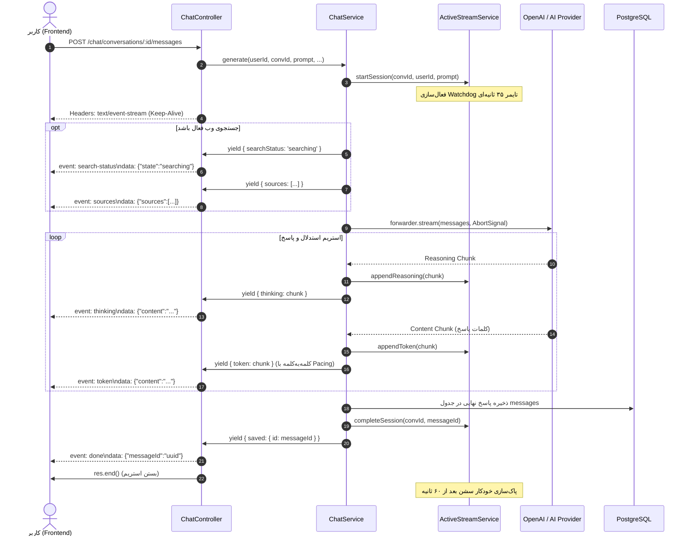

# مستندات جامع جریان استریمینگ چت در بک‌اند (Backend SSE Chat Architecture)

این سند فرآیند کامل پیاده‌سازی **Server-Sent Events (SSE)** در بخش بک‌اند چت را تشریح می‌کند. معماری استریم چت در این پلتفرم به صورت **کاملاً ماژولار و مستقل از سوکت کاربر (Decoupled Stream)** پیاده‌سازی شده است تا در صورت قطع ارتباط کاربر یا رفرش صفحه، فرآیند تولید پاسخ قطع نشده و بدون از دست رفتن توکن‌ها ادامه یابد.

---

## ۱. نمای کلی معماری استریمینگ (High-Level Architecture)

جریان سنتی استریم مستقیماً سوکت کلاینت را به هوش مصنوعی وصل می‌کرد که با بستن تب، کل پیام می‌سوخت. در این سیستم یک معماری ۲ لایه طراحی شده است:

```
[ کلاینت فرانت‌اند ]
       │
       │ (1) POST /chat/conversations/:id/messages
       ▼
[ ChatController ] ──(راه‌اندازی)──► [ ChatService.generate ]
       │                                     │
       │                                     ▼
       │                          [ ActiveStreamService ] (در حافظه سرور)
       │                                     │
       │                                     ├──► اتصال به هوش مصنوعی (OpenAiCompatForwarder)
       │                                     ├──► جستجوی وب زنده (WebSearchService)
       │                                     └──► ذخیره بافر توکن‌ها + تایمر Watchdog
       ▼
[ خط لوله SSE ] ◄───(ارسال رویدادها)────────┘
(Content-Type: text/event-stream)
```

### ویژگی‌های کلیدی این طراحی:
1. **جداسازی سوکت از تولید هوش مصنوعی (Decoupled Engine):** حتی اگر اینترنت کاربر قطع شود، هوش مصنوعی کارش را تمام کرده و پاسخ نهایی در دیتابیس ذخیره می‌گردد.
2. **قابلیت اتصال مجدد و همگام‌سازی (Catch-up & Reconnect):** کاربر با باز کردن مجدد صفحه می‌تواند به استریم متصل شود و پیام‌های رد شده را با رویداد `sync` یکجا دریافت کند.
3. **تنظیم ریتم خروج کلمات (Word Pacing):** قطعات حجیم دریافتی از هوش مصنوعی کلمه‌به‌کلمه شکسته شده و با مکث طبیعی ارسال می‌شوند تا انیمیشن تایپ روان باشد.
4. **پایشگر زنده وضعیت استدلال (Deep Thinking & Reasoning):** تفکیک محتوای فکر کردن مدل (`thinking`) از پاسخ نهایی با سنجش میلی‌ثانیه‌ای زمان تفکر.
5. **تایمر نگهبان ۳۵ ثانیه‌ای (Watchdog Timer):** در صورت فریز شدن سرور مدل یا جستجوی وب، نشست به صورت ایمن Timeout شده و قفل نمی‌ماند.

---

## ۲. هدرها و قالب رویدادهای SSE (Protocol & Event Schema)

پاسخ کنترلر روی استریم خروجی HTTP با هدرهای استاندارد زیر تنظیم می‌شود:
```http
Content-Type: text/event-stream
Cache-Control: no-cache
Connection: keep-alive
```

هر پیام با الگوی `event: <name>\ndata: <json>\n\n` روی لوله شبکه نوشته می‌شود. لیست کلیه رویدادهای ارسالی در بک‌اند:

| نام رویداد (`event`) | نمونه داده ارسالی (`data`) | کاربرد و رفتار کلاینت |
| :--- | :--- | :--- |
| `search-status` | `{"state": "searching"}` | نمایش وضعیت انیمیشنی «در حال جستجو در وب» |
| `sources` | `{"sources": [{"title": "..", "url": ".."}]}` | ارسال لیست پیوندهای وب پیدا شده به عنوان مراجع |
| `sources-error` | `{"message": "جستجوی وب ناموفق بود..."}` | اعلام شکست سرچ وب و ادامه تولید متن بدون منابع |
| `thinking-status` | `{"state": "thinking", "durationMs": 4200}` | وضعیت آغاز یا پایان فرایند استدلال مدل (`thinking` یا `done`) |
| `thinking` | `{"content": "..."}` | توکن‌های متنی فرایند تفکر مدل (Chain of Thought) |
| `token` | `{"content": "سلام "}` | توکن‌های متن اصلی پاسخ مدل (با پیسینگ نرم) |
| `title` | `{"title": "برنامه‌نویسی پایتون"}` | ارسال عنوان هوشمند تولیدشده برای گفتگو در پس‌زمینه |
| `sync` | `{"content": "..."}` | همگام‌سازی متن تولیدشده قبل از اتصال مجدد کلاینت |
| `done` | `{"messageId": "uuid-..."}` | پایان استریم، ذخیره نهایی در دیتابیس و اعلام شناسه پیام |
| `error` | `{"error": "...", "message": "..."}` | خطای مدل یا پایان مهلت زمانی (Timeout) |

---

## ۳. بررسی فنی کامپوننت‌های بک‌اند

### ۱. سرویس مدیریت استریم در حافظه (`ActiveStreamService`)
**مسیر:** `backend/src/modules/chat/active-stream.service.ts`

این سرویس یک مخزن `Map<conversationId, ActiveStreamSession>` درون حافظه RAM سرور نگه‌می‌دارد:

```typescript
export interface ActiveStreamSession {
  conversationId: string;
  userId: string;
  accumulatedText: string;     // کل توکن‌های پاسخ تا این لحظه
  reasoningText?: string;      // کل توکن‌های بخش استدلال (تفکر)
  status: 'thinking' | 'streaming' | 'completed' | 'error';
  abortController: AbortController; // برای لغو دستی درخواست به ارائه‌دهنده
  subscribers: Set<(event: StreamEvent) => void>; // شنوندگان سوکت فعال
  thinkingTimer?: any;         // تایمر نگهبان ۳۵ ثانیه‌ای
  cleanupTimer?: any;          // تایمر پاک‌سازی حافظه بعد از اتمام (۶۰ ثانیه)
}
```

#### متدهای کلیدی:
* **`startSession`**: ایجاد نشست جدید یا بازیابی نشست در حال اجرای قبلی. اگر استریم در مرحله تفکر بیش از ۳۵ ثانیه بدون توکن بماند، با متد `failSession` نشست را با خطا می‌بندد.
* **`appendToken`**: افزودن توکن به متن تجمیعی (`accumulatedText`)، تغییر وضعیت به `streaming`، خاموش کردن تایمر تفکر، و انتشار بلادرنگ به تمام سوکت‌های مشترک (`subscribers`).
* **`appendReasoning`**: اضافه کردن تکه استدلال به `reasoningText`، تمدید تایمر تفکر با `resetThinkingTimer` و پخش به مشترکین.
* **`completeThinking`**: اعلام پایان تفکر مدل، ثبت مدت زمان مصرف‌شده بر حسب میلی‌ثانیه و صدور رویداد `thinking-status: done`.
* **`subscribe`**: اضافه کردن یک شنونده (سوکت) به نشست جهت دریافت رویدادهای بلادرنگ.
* **`abortSession`**: صدا زدن متد `abortController.abort()`، تغییر وضعیت به `completed` و بستن نشست.
* **`scheduleCleanup`**: زمان‌بندی حذف نشست از حافظه پس از ۶۰ ثانیه جهت جلوگیری از نشت حافظه (Memory Leak).

---

### ۲. متد تولید و پردازش چت (`ChatService.generate`)
**مسیر:** `backend/src/modules/chat/chat.service.ts`

این تابع به عنوان یک **AsyncGenerator** (`async *generate(...)`) عمل می‌کند:

```
ورود درخواست 
   │
   ├──► ۱. اعتبارسنجی سهمیه کاربر (assertQuota) و افزایش کنتور پیام
   ├──► ۲. اگر استریم قبلی هنوز فعال باشد، آن را Abort می‌کند
   ├──► ۳. ثبت پیام کاربر در دیتابیس (با بررسی جلوگیری از تکرار پیام در صورت Retry)
   ├──► ۴. الحاق فایل‌های پیوست (عکس‌ها به صورت Base64 Vision و متن‌ها به کانتکست)
   ├──► ۵. در صورت درخواست، وب‌سرچ آنلاین انجام شده و `yield { sources }` می‌شود
   ├──► ۶. فراخوانی استریم هوش مصنوعی با forwarder.stream(target, messages)
   │         │
   │         ├── خواندن چانک استدلال ──► yield { thinking } + ذخیره در نشست
   │         └── خواندن چانک متن ──────► yield { token } (همراه با paceToken)
   │
   ├──► ۷. تولید غیرهمزمان عنوان گفتگو در پس‌زمینه (yield { title })
   ├──► ۸. ذخیره پاسخ نهایی در دیتابیس پیام‌ها (جدول messages)
   └──► ۹. محاسبه مصرف توکن (شامل ضرایب سرچ و تفکر) و yield { saved }
```

#### جزئیات خطای Mid-Stream:
اگر ارتباط با هوش مصنوعی در اواسط متن قطع شود (مثلاً اینترنت سرور یا لیمیت مدل):
* سرور متنی که تا آن لحظه دریافت کرده را دور نمی‌ریزد!
* پیام در دیتابیس با پرچم `isInterrupted = true` ذخیره می‌شود و توکن‌های مصرف‌شده تا همان نقطه کسر می‌گردند.

---

### ۳. مدیریت کنترلر و نوشتن روی لوله شبکه (`ChatController`)
**مسیر:** `backend/src/modules/chat/chat.controller.ts`

#### اندپوینت اصلی ارسال پیام: `POST /chat/conversations/:id/messages`
1. هدرهای SSE شامل `Content-Type: text/event-stream` و `Connection: keep-alive` را روی آبجکت `res` تنظیم می‌کند.
2. شنونده‌ی قطع ارتباط کلاینت را ثبت می‌کند:
   ```typescript
   let clientDisconnected = false;
   req.on('close', () => { clientDisconnected = true; });
   ```
3. چانک اول را به صورت دستی دریافت می‌کند تا مطمئن شود نوع پیام چیست و خطا بلافاصله هندل شود:
   ```typescript
   const first = await gen.next();
   ```
4. با یک حلقه `for await (const chunk of gen)` تک‌تک رویدادها را با `res.write` روی شبکه می‌فرستد.
5. تابع `writeToken` قبل از نوشتن چک می‌کند که آیا کلاینت قطع شده یا خروجی بسته شده است تا خطای Broken Pipe ندهد:
   ```typescript
   const writeToken = (t: string) => {
     if (!clientDisconnected && !res.writableEnded) {
       try {
         res.write(`event: token\ndata: ${JSON.stringify({ content: t })}\n\n`);
       } catch {
         clientDisconnected = true;
       }
     }
   };
   ```
6. در انتهای کار یا در صورت بروز خطای پیش‌بینی‌نشده، با `res.end()` سوکت را می‌بندد.

---

### ۴. فرآیند اتصال مجدد (Reconnect) با `GET /chat/conversations/:id/stream`
اگر کاربر صفحه را رفرش کند:
1. کلاینت وضعیت استریم را با `GET /chat/conversations/:id/active-stream` استعلام می‌کند.
2. اگر فعال بود، به `GET /chat/conversations/:id/stream` وصل می‌شود.
3. تابع `attachToActiveStream` در سرویس چت فراخوانی می‌شود:
   * ابتدا متن انباشته‌شده قبلی با `event: sync` ارسال می‌شود.
   * سپس متن‌های تفکر و منابع قبلی ارسال می‌گردند.
   * یک شنونده موقت در `session.subscribers` ثبت شده و ادامه‌ی توکن‌ها به شکل زنده به کاربر تحویل داده می‌شوند.

---

### ۵. توقف دستی با دکمه Stop: `POST /chat/conversations/:id/stop`
وقتی کاربر دکمه توقف را می‌زند:
1. درخواست به متد `stopStream` ارسال می‌شود.
2. کنترلر `activeStream.abortSession(id)` را صدا می‌زند.
3. متد `session.abortController.abort()` بلافاصله اجرای پرامیس مدل در `forwarder.stream` را متوقف می‌کند.
4. پیام تا همان کلمه‌ای که تولید شده با فلگ `stoppedByUser = true` در دیتابیس ثبت شده و سشن بسته می‌شود.

---

## ۴. نمودار توالی کامل یک چرخه استریم چت (Sequence Diagram)



---

## ۵. جمع‌بندی فنی
معماری استریم در بک‌اند این پروژه بر ۳ اصل استوار است:
1. **پایداری (Fault-Tolerance):** استریم در حافظه اجرا می‌شود، نه در وب‌سوکت. قطع شبکه کاربر مساوی با باختن پاسخ نیست.
2. **روانی خروجی (Pacing & Typing Experience):** جلوگیری از پرش‌های متنی حجیم مدل با خرد کردن متن به توکن‌های کلمه‌ای همراه با تأخیر استاندارد.
3. **انعطاف و مانیتورینگ:** پشتیبانی همزمان از تفکر مرحله‌به‌مرحله (CoT)، وب‌سرچ زنده، تولید اتوماتیک عنوان و توقف فوری توسط کاربر.
