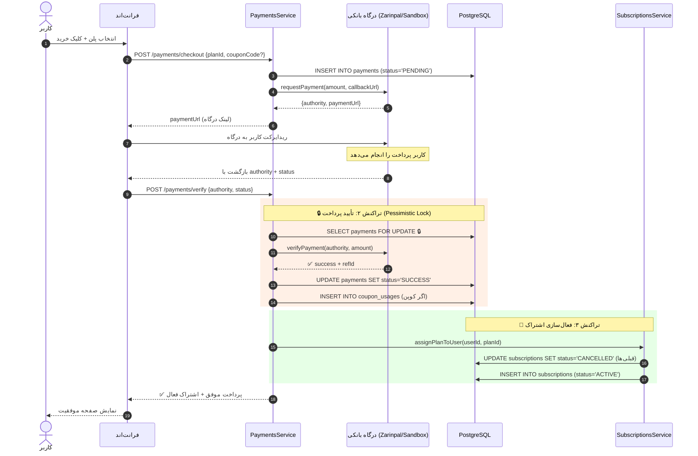

# مستندات جامع تراکنش‌های دیتابیسی پروژه (Database Transactions Guide)

این سند تمام تراکنش‌های ACID دیتابیسی پروژه را با جزئیات فنی کامل و کد واقعی تشریح می‌کند.
در این پروژه دقیقاً **۳ تراکنش حیاتی** وجود دارد که روی **۴ جدول اصلی** عمل می‌کنند.

---

## فهرست مطالب
1. [جداول درگیر در تراکنش‌ها](#۱-جداول-درگیر-در-تراکنش‌ها)
2. [تراکنش ۱: چرخش رفرش‌توکن (Token Rotation)](#تراکنش-۱-چرخش-رفرش‌توکن-token-rotation)
3. [تراکنش ۲: تأیید پرداخت درگاه بانکی (Payment Verification)](#تراکنش-۲-تأیید-پرداخت-درگاه-بانکی-payment-verification)
4. [تراکنش ۳: فعال‌سازی اشتراک کاربر (Subscription Assignment)](#تراکنش-۳-فعال‌سازی-اشتراک-کاربر-subscription-assignment)
5. [نمودار جریان سرتاسری تراکنش‌ها](#۲-نمودار-جریان-سرتاسری-تراکنش‌ها)
6. [چرا از تراکنش استفاده شده؟ (بدون تراکنش چه بلایی سرمان می‌آمد)](#۳-چرا-از-تراکنش-استفاده-شده)

---

## ۱. جداول درگیر در تراکنش‌ها

تراکنش‌های این پروژه روی ۴ جدول اصلی زیر عمل می‌کنند:

### جدول `refresh_tokens` (نشست‌های احراز هویت)
```
┌──────────────────────────────────────────────────┐
│  refresh_tokens                                  │
├──────────────────────────────────────────────────┤
│  id           UUID (PK)         شناسه نشست      │
│  userId       UUID (FK → users) شناسه کاربر     │
│  tokenHash    VARCHAR (UNIQUE)  هش SHA-256 توکن  │
│  expiresAt    TIMESTAMPTZ       زمان انقضا       │
│  isRevoked    BOOLEAN           باطل شده؟        │
│  ip           VARCHAR           آی‌پی کلاینت      │
│  userAgent    VARCHAR           مشخصات مرورگر    │
│  createdAt    TIMESTAMP         زمان ایجاد       │
└──────────────────────────────────────────────────┘
```
**فایل:** `backend/src/modules/auth/refresh-token.entity.ts`

---

### جدول `payments` (تراکنش‌های پرداخت)
```
┌──────────────────────────────────────────────────┐
│  payments                                        │
├──────────────────────────────────────────────────┤
│  id              UUID (PK)         شناسه پرداخت  │
│  userId          UUID (FK → users) شناسه کاربر   │
│  planId          UUID (FK → plans) شناسه پلن     │
│  amount          BIGINT            مبلغ نهایی     │
│  originalAmount  BIGINT            مبلغ اصلی      │
│  discountAmount  BIGINT            مبلغ تخفیف     │
│  couponId        UUID (FK)         شناسه کوپن    │
│  currency        VARCHAR(10)       واحد پول (IRR) │
│  status          ENUM              وضعیت پرداخت   │
│    → PENDING | SUCCESS | FAILED | CANCELLED       │
│  gateway         VARCHAR(50)       درگاه بانکی    │
│  authority       VARCHAR(100)      شناسه مرجع     │
│  refId           VARCHAR(100)      کد پیگیری      │
│  idempotencyKey  VARCHAR(100)      کلید یکتایی    │
│  ip              TEXT              آی‌پی           │
│  verifiedAt      TIMESTAMPTZ       زمان تأیید     │
│  metadata        JSONB             اطلاعات اضافی  │
│  createdAt       TIMESTAMPTZ       زمان ایجاد     │
└──────────────────────────────────────────────────┘
```
**فایل:** `backend/src/modules/payments/payment.entity.ts`

---

### جدول `subscriptions` (اشتراک‌های کاربران)
```
┌──────────────────────────────────────────────────────┐
│  subscriptions                                       │
├──────────────────────────────────────────────────────┤
│  id                 UUID (PK)          شناسه اشتراک │
│  userId             UUID (FK → users)  شناسه کاربر  │
│  planId             UUID (FK → plans)  شناسه پلن    │
│  status             ENUM               وضعیت اشتراک │
│    → ACTIVE | EXPIRED | CANCELLED | PENDING          │
│  startDate          TIMESTAMPTZ        تاریخ شروع   │
│  endDate            TIMESTAMPTZ        تاریخ پایان  │
│  paymentId          UUID (FK)          شناسه پرداخت │
│  source             VARCHAR(30)        منبع فعال‌سازی│
│  cancelledAt        TIMESTAMPTZ        زمان لغو     │
│  cancellationReason TEXT               دلیل لغو     │
│  metadata           JSONB              اطلاعات اضافی│
│  createdAt          TIMESTAMPTZ        زمان ایجاد   │
└──────────────────────────────────────────────────────┘
```
**فایل:** `backend/src/modules/subscriptions/subscription.entity.ts`

---

### جدول `coupon_usages` (ثبت مصرف کد تخفیف)
```
┌──────────────────────────────────────────────────┐
│  coupon_usages                                   │
├──────────────────────────────────────────────────┤
│  id              UUID (PK)         شناسه مصرف   │
│  couponId        UUID (FK)         شناسه کوپن   │
│  userId          UUID (FK → users) شناسه کاربر  │
│  paymentId       UUID (FK)         شناسه پرداخت │
│  discountAmount  DECIMAL(12,2)     مبلغ تخفیف   │
│  createdAt       TIMESTAMP         زمان ثبت     │
└──────────────────────────────────────────────────┘
```
**فایل:** `backend/src/modules/payments/coupon-usage.entity.ts`

---

## تراکنش ۱: چرخش رفرش‌توکن (Token Rotation)

### داستان ساده
فرض کنید Access Token کاربر منقضی شده. فرانت‌اند Refresh Token قدیمی را می‌فرستد تا توکن جدید بگیرد.
سرور باید **همزمان** دو کار کند:
1. توکن قدیمی را باطل کند (`isRevoked = true`)
2. توکن جدید را درج کند

اگر بین این دو مرحله سرور کرش کند و فقط مرحله ۱ انجام شده باشد، کاربر بدون توکن معتبر گیر می‌کند!
**راه‌حل:** هر دو عملیات در یک تراکنش اتمیک انجام می‌شوند.

### فایل و محل دقیق
- **فایل:** `backend/src/modules/auth/auth.service.ts`
- **متد:** `refresh(rawRefreshToken, clientInfo)`
- **خط:** ~131

### جداول درگیر
| جدول | عملیات |
|-------|--------|
| `refresh_tokens` | **UPDATE** → باطل کردن توکن قبلی (`isRevoked = true`) |
| `refresh_tokens` | **INSERT** → درج رکورد توکن جدید با هش SHA-256 |

### کد واقعی تراکنش

```typescript
// auth.service.ts → متد refresh

// --- قبل از تراکنش: اعتبارسنجی ---
const decoded = this.jwt.verify(rawRefreshToken, { ignoreExpiration: false });
const tokenHash = this.hashToken(rawRefreshToken);
const existing = await this.refreshTokenRepo.findOne({ where: { tokenHash } });

// بررسی Reuse Detection: اگر توکن قبلاً باطل شده ولی دوباره استفاده شده
if (existing.isRevoked || existing.expiresAt < new Date()) {
  // ⚠️ احتمال نفوذ! همه نشست‌های کاربر را باطل کن
  await this.refreshTokenRepo.update({ userId: decoded.sub }, { isRevoked: true });
  throw new UnauthorizedException('رفرش توکن نامعتبر است');
}

// --- تراکنش اتمیک ---
newTokens = await this.dataSource.transaction(async (manager) => {
  const repo = manager.getRepository(RefreshToken);

  // گام ۱: باطل کردن توکن استفاده‌شده
  existing.isRevoked = true;
  await repo.save(existing);

  // گام ۲: تولید و ذخیره توکن‌های جدید (درون همین تراکنش)
  return await this.tokens(user, clientInfo, manager);
});
// --- پایان تراکنش ---
```

### چه اتفاقی در `this.tokens(...)` درون تراکنش می‌افتد؟

```typescript
async tokens(user, clientInfo, manager?) {
  // تولید Access Token با JWT
  const accessToken = this.jwt.sign({
    sub: user.id, email: user.email, role: user.role, type: 'access'
  });

  // تولید Refresh Token تصادفی
  const rawRefresh = crypto.randomBytes(64).toString('hex');
  const refreshToken = this.jwt.sign({ sub: user.id, type: 'refresh' });

  // ذخیره هش رفرش‌توکن (نه خود توکن!) در دیتابیس
  const repo = manager ? manager.getRepository(RefreshToken) : this.refreshTokenRepo;
  await repo.save({
    userId: user.id,
    tokenHash: this.hashToken(refreshToken),  // SHA-256
    expiresAt: new Date(Date.now() + 7 * 24 * 3600_000),
    ip: clientInfo?.ip,
    userAgent: clientInfo?.userAgent,
  });

  return { accessToken, refreshToken };
}
```

### خلاصه
```
┌─ BEGIN TRANSACTION ─────────────────────────┐
│                                             │
│  1. UPDATE refresh_tokens                   │
│     SET isRevoked = true                    │
│     WHERE tokenHash = '<hash-توکن-قدیمی>'    │
│                                             │
│  2. INSERT INTO refresh_tokens              │
│     (userId, tokenHash, expiresAt, ip, ...)  │
│     VALUES ('<user-id>', '<hash-جدید>', ...)  │
│                                             │
└─ COMMIT ────────────────────────────────────┘
```

---

## تراکنش ۲: تأیید پرداخت درگاه بانکی (Payment Verification)

### داستان ساده
کاربر از درگاه زرین‌پال/سندباکس برگشته. حالا سرور باید:
1. رکورد پرداخت را پیدا کند
2. با درگاه تأیید کند که پول واقعاً واریز شده
3. وضعیت را به `SUCCESS` تغییر دهد
4. مصرف کد تخفیف را ثبت کند

**مشکل بزرگ:** اگر کاربر دکمه «بررسی پرداخت» را سریع ۲ بار بزند (Double-Click)، ممکن است اشتراک ۲ بار فعال شود!
**راه‌حل:** قفل بدبینانه (`PESSIMISTIC_WRITE`) + بررسی Idempotency.

### فایل و محل دقیق
- **فایل:** `backend/src/modules/payments/payments.service.ts`
- **متد:** `verifyPayment(dto, actorId)`
- **خط:** ~211

### جداول درگیر
| جدول | عملیات | قفل |
|-------|--------|-----|
| `payments` | **SELECT FOR UPDATE** → قفل بدبینانه | `PESSIMISTIC_WRITE` 🔒 |
| `payments` | **UPDATE** → تغییر وضعیت به `SUCCESS` / `FAILED` / `CANCELLED` | — |
| `coupon_usages` | **INSERT** → ثبت مصرف کد تخفیف (در صورت استفاده کوپن) | — |

### کد واقعی تراکنش

```typescript
// payments.service.ts → متد verifyPayment

const txResult = await this.dataSource.transaction(async (manager) => {
  const paymentRepo = manager.getRepository(Payment);

  // 🔒 قفل بدبینانه: هیچ درخواست دیگری نمی‌تواند این رکورد را بخواند تا تراکنش تمام شود
  const payment = await paymentRepo
    .createQueryBuilder('p')
    .where('p.authority = :authority', { authority: dto.authority })
    .setLock('pessimistic_write')   // ← SELECT ... FOR UPDATE
    .getOne();

  if (!payment) {
    throw new NotFoundException('تراکنش با این شناسه مرجع یافت نشد.');
  }

  // ✅ بررسی Idempotency: اگر قبلاً SUCCESS شده، دوباره کاری نکن
  if (payment.status === PaymentStatus.SUCCESS) {
    return { alreadyVerified: true, payment };
  }

  // اگر CANCELLED یا FAILED بوده، خروج ایمن
  if (payment.status === PaymentStatus.CANCELLED || payment.status === PaymentStatus.FAILED) {
    return { cancelled: true, payment };
  }

  // ارتباط با درگاه بانکی برای تأیید واقعی پرداخت
  const gatewayProvider =
    payment.gateway === 'zarinpal' ? this.zarinpalGateway : this.sandboxGateway;

  const verifyResult = await gatewayProvider.verifyPayment({
    authority: dto.authority,
    amount: Number(payment.amount),
    payload: dto.payload || { status: dto.status },
  });

  if (!verifyResult.success) {
    // ❌ پرداخت ناموفق یا لغو شده توسط کاربر
    const isCancellation = dto.status?.toUpperCase() === 'NOK' || ...;
    payment.status = isCancellation ? PaymentStatus.CANCELLED : PaymentStatus.FAILED;
    payment.metadata = { ...payment.metadata, failureReason: verifyResult.message };
    await paymentRepo.save(payment);
    return { failed: true, isCancellation, verifyResult, payment };
  }

  // ✅ پرداخت موفق
  payment.status = PaymentStatus.SUCCESS;
  payment.refId = verifyResult.refId;
  payment.verifiedAt = new Date();
  payment.metadata = { ...payment.metadata, gatewayResponse: verifyResult.rawResponse };
  await paymentRepo.save(payment);

  // ثبت مصرف کد تخفیف درون همین تراکنش
  if (payment.couponId) {
    await this.couponsService.recordUsage(
      payment.couponId,
      payment.userId,
      payment.id,
      Number(payment.discountAmount || 0),
      manager,  // ← پاس دادن manager تراکنش
    );
  }

  return { success: true, verifyResult, payment };
});

// ⬇️ بعد از COMMIT تراکنش و آزاد شدن قفل:
// فعال‌سازی اشتراک (عمداً خارج از تراکنش پرداخت برای جلوگیری از Deadlock)
await this.subscriptionsService.assignPlanToUser({
  userId: txResult.payment.userId,
  planId: txResult.payment.planId,
  paymentId: txResult.payment.id,
  source: 'purchase',
});
```

### نکته معماری مهم: چرا فعال‌سازی اشتراک خارج از تراکنش پرداخت است؟

```
// در کامنت واقعی کد:
// 3. Activate subscription outside the payment lock transaction (avoids FK deadlock)
```

اگر فعال‌سازی اشتراک هم داخل تراکنش پرداخت بود، دو قفل همزمان روی جداول `payments` و `subscriptions` ایجاد می‌شد. اگر دقیقاً همزمان یک درخواست دیگر بخواهد وضعیت اشتراک را بخواند و پرداخت جدیدی ثبت کند، **Deadlock** رخ می‌دهد. بنابراین تراکنش پرداخت ابتدا Commit می‌شود، قفل آزاد می‌شود، و سپس اشتراک در یک تراکنش مجزا فعال می‌گردد.

### خلاصه
```
┌─ BEGIN TRANSACTION ───────────────────────────────┐
│                                                   │
│  1. SELECT * FROM payments                        │
│     WHERE authority = '...'                       │
│     FOR UPDATE   🔒 قفل بدبینانه                   │
│                                                   │
│  2. (ارتباط با درگاه بانکی برای تأیید)              │
│                                                   │
│  3. UPDATE payments                               │
│     SET status = 'SUCCESS',                       │
│         refId = '...', verifiedAt = NOW()         │
│     WHERE id = '<payment-id>'                     │
│                                                   │
│  4. INSERT INTO coupon_usages (اگر کوپن داشته باشد) │
│     (couponId, userId, paymentId, discountAmount)  │
│                                                   │
│  5. UPDATE coupons SET usedCount = usedCount + 1   │
│                                                   │
└─ COMMIT ──────────────────────────────────────────┘
     │
     ▼ (بعد از آزاد شدن قفل)
  فعال‌سازی اشتراک → تراکنش ۳
```

---

## تراکنش ۳: فعال‌سازی اشتراک کاربر (Subscription Assignment)

### داستان ساده
بعد از تأیید پرداخت (یا اختصاص دستی توسط ادمین)، پلن جدید باید فعال شود.
اما کاربر ممکن است الان اشتراک فعال دیگری داشته باشد! سرور باید:
1. اشتراک‌های فعال قبلی را لغو کند
2. اشتراک جدید را فعال کند

اگر بین این دو مرحله خطایی رخ دهد، کاربر ممکن است **هم‌زمان** دو اشتراک فعال داشته باشد یا هیچ اشتراکی نداشته باشد!
**راه‌حل:** هر دو عملیات در یک تراکنش اتمیک.

### فایل و محل دقیق
- **فایل:** `backend/src/modules/subscriptions/subscriptions.service.ts`
- **متد:** `assignPlanToUser(options)`
- **خط:** ~92

### جداول درگیر
| جدول | عملیات |
|-------|--------|
| `subscriptions` | **UPDATE** → لغو اشتراک‌های فعال فعلی (`status = 'CANCELLED'`) |
| `subscriptions` | **INSERT** → ایجاد اشتراک جدید (`status = 'ACTIVE'`) |

### کد واقعی تراکنش

```typescript
// subscriptions.service.ts → متد assignPlanToUser

const plan = await this.plansService.findById(options.planId);
const duration = options.durationDays ?? plan.durationDays;
const startDate = new Date();
const endDate = duration > 0
  ? new Date(startDate.getTime() + duration * 86400000)  // ۸۶۴۰۰۰۰۰ms = یک روز
  : null;

saved = await this.dataSource.transaction(async (manager) => {
  const subRepo = manager.getRepository(Subscription);

  // گام ۱: یافتن همه اشتراک‌های فعال کاربر
  const currentActive = await subRepo.find({
    where: { userId: options.userId, status: SubscriptionStatus.ACTIVE },
  });

  // گام ۲: لغو تک‌تک آن‌ها
  for (const sub of currentActive) {
    sub.status = SubscriptionStatus.CANCELLED;
    sub.cancelledAt = new Date();
    sub.cancellationReason = 'superseded_by_new_plan';  // جایگزین شده توسط پلن جدید
    await subRepo.save(sub);
  }

  // گام ۳: ایجاد اشتراک جدید
  const newSub = subRepo.create({
    userId: options.userId,
    planId: plan.id,
    plan: plan,
    status: SubscriptionStatus.ACTIVE,
    startDate,
    endDate,
    paymentId: options.paymentId || null,
    source: options.source || 'purchase',
  });

  return await subRepo.save(newSub);
});

// بعد از تراکنش: ثبت لاگ حسابرسی
await this.auditService.log({
  actorId: options.actorId ?? options.userId,
  action: 'subscription.assigned',
  entityType: 'subscription',
  entityId: saved.id,
  metadata: { planName: plan.name, source: options.source },
});
```

### خلاصه
```
┌─ BEGIN TRANSACTION ────────────────────────────────┐
│                                                    │
│  1. SELECT * FROM subscriptions                    │
│     WHERE userId = '...' AND status = 'ACTIVE'     │
│                                                    │
│  2. UPDATE subscriptions                           │
│     SET status = 'CANCELLED',                      │
│         cancelledAt = NOW(),                       │
│         cancellationReason = 'superseded_by_...'   │
│     WHERE id IN (<اشتراک‌های فعال قبلی>)             │
│                                                    │
│  3. INSERT INTO subscriptions                      │
│     (userId, planId, status, startDate, endDate,   │
│      paymentId, source)                            │
│     VALUES ('...', '...', 'ACTIVE', ...)           │
│                                                    │
└─ COMMIT ───────────────────────────────────────────┘
```

---

## ۲. نمودار جریان سرتاسری تراکنش‌ها

### نمودار ارتباط تراکنش‌ها با جداول

```
                    ┌─────────────────────────────┐
                    │        refresh_tokens        │
                    │  (تراکنش ۱: چرخش توکن)       │
                    └──────────┬──────────────────┘
                               │
          ┌────────────────────┴────────────────────┐
          │           auth.service.ts                │
          │   dataSource.transaction(...)            │
          │   UPDATE old → INSERT new                │
          └────────────────────────────────────────┘


                    ┌─────────────────────────────┐
                    │          payments            │
                    │  (تراکنش ۲: تأیید پرداخت)    │
                    │  🔒 PESSIMISTIC_WRITE        │
                    └──────────┬──────────────────┘
                               │
         ┌─────────────────────┼─────────────────────┐
         │                     │                      │
         ▼                     ▼                      ▼
  ┌──────────────┐   ┌─────────────────┐   ┌──────────────────┐
  │   payments   │   │  coupon_usages  │   │  subscriptions   │
  │ UPDATE → OK  │   │ INSERT usage    │   │  (تراکنش ۳)      │
  └──────────────┘   └─────────────────┘   │  CANCEL old      │
                                           │  INSERT new      │
                                           └──────────────────┘
```

### نمودار توالی کامل خرید اشتراک (End-to-End)



---

## ۳. چرا از تراکنش استفاده شده؟

### بدون تراکنش چه بلایی سرمان می‌آمد؟

| سناریوی خطرناک | بدون تراکنش | با تراکنش |
|:---|:---|:---|
| **توکن**: سرور توکن قدیمی را باطل کرد ولی قبل از ذخیره توکن جدید کرش کرد | ❌ کاربر بدون هیچ توکن معتبری گیر می‌کند و باید دوباره لاگین کند | ✅ کل عملیات Rollback می‌شود و توکن قدیمی هنوز معتبر است |
| **پرداخت**: دو درخواست `verify` همزمان برسد (Double-Click) | ❌ اشتراک ۲ بار فعال شده، کوپن ۲ بار مصرف می‌شود | ✅ قفل `PESSIMISTIC_WRITE` فقط به اولین درخواست اجازه پردازش می‌دهد؛ دومی صبر می‌کند و `alreadyVerified = true` می‌گیرد |
| **اشتراک**: اشتراک قبلی لغو شد ولی اشتراک جدید ثبت نشد | ❌ کاربر بدون اشتراک می‌ماند و پولش هم رفته | ✅ هر دو عملیات یا با هم Commit می‌شوند یا هیچ‌کدام |
| **کوپن**: پرداخت FAILED شد ولی مصرف کوپن ثبت شد | ❌ کاربر نتوانسته پرداخت کند ولی کد تخفیفش سوخته | ✅ چون `recordUsage` درون همان تراکنش پرداخت است، با FAIL شدن پرداخت، مصرف کوپن هم Rollback می‌شود |

### نوع قفل‌ها

| تراکنش | نوع قفل | توضیح |
|:---|:---|:---|
| چرخش توکن | **بدون قفل صریح** (Serializable implicit) | تنها یک درخواست همزمان برای هر توکن ممکن است (هش توکن UNIQUE است) |
| تأیید پرداخت | **`PESSIMISTIC_WRITE`** (`SELECT ... FOR UPDATE`) | مانع خوانده شدن رکورد توسط درخواست‌های همزمان تا پایان تراکنش |
| فعال‌سازی اشتراک | **بدون قفل صریح** (Row-level implicit) | ایزوله‌سازی با تراکنش TypeORM به‌تنهایی کافی است |

---

## ۴. خلاصه یک‌نظری (Quick Reference)

| # | تراکنش | فایل | جداول | عملیات اصلی | قفل |
|---|--------|------|-------|-------------|-----|
| ۱ | چرخش رفرش‌توکن | `auth.service.ts` | `refresh_tokens` | Revoke قدیمی + Insert جدید | — |
| ۲ | تأیید پرداخت | `payments.service.ts` | `payments` + `coupon_usages` | Lock + Verify + Update + Insert | `PESSIMISTIC_WRITE` 🔒 |
| ۳ | فعال‌سازی اشتراک | `subscriptions.service.ts` | `subscriptions` | Cancel قبلی‌ها + Insert جدید | — |

> **الگوی مشترک:** هر سه تراکنش از `this.dataSource.transaction(async (manager) => { ... })` استفاده می‌کنند.
> `manager` یک `EntityManager` محدود به آن تراکنش است و هرگونه خطای پرتاب‌شده درون آن، کل تراکنش را Rollback می‌کند.
