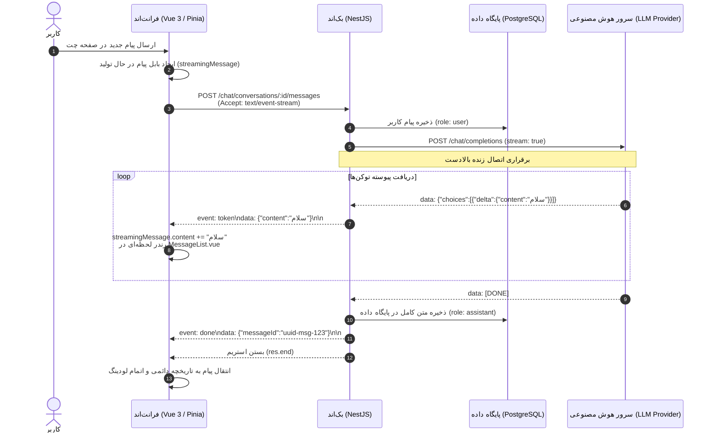

# 📖 راهنمای جامع معماری استریمینگ (Streaming Architecture)

این سند مرجع فنی نحوه پیاده‌سازی و جریان داده‌های بلادرنگ (Real-time Token Streaming) در پلتفرم **NeuralChat** را از لایه هوش مصنوعی بالادست (Upstream) تا بک‌اند (NestJS) و فرانت‌اند (Vue 3) به همراه پروتکل تبادل داده تشریح می‌کند.

---

## 📌 استریمینگ طرف بک‌اِند است یا فرانت‌اِند؟

استریمینگ یک **فرآیند سرتاسری و دوطرفه (End-to-End Pipeline)** است و نمی‌تواند صرفاً در یک لایه وجود داشته باشد. این فرآیند از یک زنجیره سه‌لایه تشکیل شده است:

```
[AI Model Provider] ──(SSE/Chunked)──► [Backend (NestJS)] ──(SSE)──► [Frontend (Vue 3)]
```

- **نقش بک‌اِند:** دریافت پاسخ از پرووایدرهای بالادستی با فعال بودن پارامتر `stream: true`، حفظ توکن‌ها و بازپخش زنده (Relay) آن‌ها از طریق پروتکل **Server-Sent Events (SSE)** با فرمت `text/event-stream` به سمت کاربر، و نهایتاً ذخیره پیام یکپارچه‌شده در پایگاه داده PostgreSQL.
- **نقش فرانت‌اِند:** ارسال درخواست با هدر `Accept: text/event-stream`، بازخوانی پیوسته استریم با استفاده از `fetch` و `ReadableStream`، کدگشایی با `TextDecoder`، و تزریق آنی توکن‌ها به استور واکنش‌پذیر Pinia برای تایپ زنده در رابط کاربری (Vue 3).

---

## 🔄 دیاگرام توالی جریان داده (Streaming Sequence Diagram)



---

## ⚙️ ۱. نحوه کار در سمت بک‌اِند (Backend Implementation)

### الف) تولیدکننده ناهمگام (`AsyncGenerator`) در [`backend/src/modules/chat/chat.service.ts`](file:///d:/codeless_final/backend/src/modules/chat/chat.service.ts)
متد `generate` در چت سرویس با کلمه کلیدی `async *` تعریف شده است:
1. اعتبارسنجی مالکیت گفتگو و بررسی فعال بودن مدل و پرووایدر هوش مصنوعی.
2. ثبت پیام کاربر در دیتابیس.
3. فراخوانی کلاینت بالادست با `this.forwarder.stream(...)`.
4. با دریافت هر توکن از سرور مدل، با دستور `yield { token }` آن را بلافاصله برای کنترلر پمپاژ می‌کند:
```typescript
for await (const token of this.forwarder.stream(target, messages)) {
  full += token;
  yield { token }; // ارسال بدون معطلی به کنترلر
}
// ذخیره در پایگاه داده پس از پایان استریم:
const saved = await this.msg.save(
  this.msg.create({ conversationId: id, role: 'assistant', content: full })
);
yield { saved };
```

### ب) کنترلر و هندلینگ پروتکل SSE در [`backend/src/modules/chat/chat.controller.ts`](file:///d:/codeless_final/backend/src/modules/chat/chat.controller.ts)
کنترلر درخواست ارسالی را دریافت و با تنظیم هدرهای استاندارد استریمینگ، فریم‌های SSE را به سمت کلاینت می‌فرستد:
```typescript
res.setHeader('Content-Type', 'text/event-stream');
res.setHeader('Cache-Control', 'no-cache');

const writeToken = (t: string) =>
  res.write(`event: token\ndata: ${JSON.stringify({ content: t })}\n\n`);

for await (const chunk of gen) {
  if (chunk.token) writeToken(chunk.token);
  if (chunk.saved) {
    res.write(`event: done\ndata: ${JSON.stringify({ messageId: chunk.saved.id })}\n\n`);
  }
}
res.end();
```

### ج) تاب‌آوری خطا (Resilience & Error Handling)
- **خطا پیش از دریافت توکن:** اگر پرووایدر در دسترس نباشد، پاسخ به عنوان خطای معمولی JSON (با کد `502 Bad Gateway`) برمی‌گردد.
- **قطعی در حین استریم (Mid-stream):** اگر اتصال مدل در میانه استریم قطع شود، بک‌اند متن دریافت شده تا آن لحظه را در دیتابیس ذخیره کرده و با ارسال `event: done` استریم را به شکل تمیز می‌بندد تا پیام از بین نرود.

---

## 💻 ۲. نحوه کار در سمت فرانت‌اِند (Frontend Implementation)

### الف) کلاینت استریم در [`frontend/src/services/chat.service.ts`](file:///d:/codeless_final/frontend/src/services/chat.service.ts)
فرانت‌اند با متد `sendMessageStream` اتصال را با `fetch` برقرار کرده و بایت‌ها را به صورت چانک به چانک با `ReadableStream` دریافت می‌کند:
```typescript
const response = await fetch(url, {
  method: 'POST',
  headers: {
    'Content-Type': 'application/json',
    'Accept': 'text/event-stream',
    'Authorization': `Bearer ${token}`
  },
  body: JSON.stringify({ content })
});

const reader = response.body.getReader();
const decoder = new TextDecoder('utf-8');
let buffer = '';

while (true) {
  const { done, value } = await reader.read();
  if (done) break;

  buffer += decoder.decode(value, { stream: true });
  const lines = buffer.split('\n');
  buffer = lines.pop() || '';

  for (const line of lines) {
    if (line.startsWith('event:')) {
      currentEvent = line.substring(6).trim();
    } else if (line.startsWith('data:')) {
      const data = JSON.parse(line.substring(5).trim());
      if (currentEvent === 'token') {
        onToken(data.content); // ارسال توکن جدید
      } else if (currentEvent === 'done') {
        onDone(data.messageId); // پیام کامل شد
      }
    }
  }
}
```

### ب) استور واکنش‌پذیر Pinia در [`frontend/src/stores/chat.ts`](file:///d:/codeless_final/frontend/src/stores/chat.ts)
- با ورود هر توکن، متن به `streamingMessage.content` افزوده می‌شود.
- کامپوننت `MessageList.vue` به این تغییر واکنش نشان داده و کلمه جدید را فوراً روی صفحه می‌نویسد.
- اسکرول چت به صورت خودکار با ورود کلمات جدید به سمت پایین هدایت می‌شود (`scrollToBottom`).

---

## 📋 ۳. ساختار و پروتکل پیام‌های ارسالی (Wire Format)

پروتکل استفاده شده در پلتفرم مبتنی بر Server-Sent Events استاندارد است:

```http
HTTP/1.1 200 OK
Content-Type: text/event-stream
Cache-Control: no-cache
Connection: keep-alive

event: token
data: {"content":"سلام"}

event: token
data: {"content":"! چطور"}

event: token
data: {"content":" می‌تونم کمکتون"}

event: token
data: {"content":" کنم؟"}

event: done
data: {"messageId":"c56a4180-65aa-42ec-a945-5fd21dec0538"}
```

---

## ⚖️ ۴. مقایسه حالت استریمینگ با حالت JSON عادی

| قابلیت | استریمینگ (SSE) | حالت عادی (JSON) |
| :--- | :--- | :--- |
| **هدر درخواستی** | `Accept: text/event-stream` | `Accept: application/json` |
| **سرعت اولین پاسخ (TTFT)** | **کمتر از ۱ ثانیه** (از اولین کلمه) | وابسته به طول کل پاسخ (بین ۳ تا ۱۵ ثانیه) |
| **تجربه کاربری (UX)** | پویا و زنده شبیه انسان در حال پاسخ | صفحه استاتیک با لودینگ طولانی |
| **ذخیره‌سازی در دیتابیس** | در پایان جریان یا هنگام توقف/قطعی به صورت اتمیک | در پایان پردازش |
| **سازگاری با اینترنت ضعیف** | عالی (انتقال تدریجی چانک‌ها) | ممکن است با تایم‌اوت مواجه شود |

---

## 🛑 ۵. قابلیت توقف تولید پاسخ (Stop Streaming on Click)

یکی از قابلیت‌های کلیدی و کاربردی استریمینگ، امکان **توقف آنی پاسخ** با کلیک کاربر است:

### چگونه کار می‌کند؟
1. **سمت فرانت‌اِند (AbortController):**
   - به محض شروع استریم، یک `new AbortController()` ساخته شده و سیگنال آن (`signal: abortController.signal`) به تابع `fetch()` متصل می‌شود.
   - وقتی کاربر دکمه توقف (دکمه مربعی کنار فرم ارسال یا دکمه «توقف تولید پاسخ» زیر حباب چت) را کلیک می‌کند:
     - متد `abortController.abort()` فراخوانی می‌شود.
     - اتصال شبکه فوراً قطع می‌شود تا هیچ داده اضافی دیگری از سرور دانلود نگردد.
     - متنی که تا آن ثانیه تایپ شده بود در صفحه نگه داشته شده و پرچم `isInterrupted: true` می‌گیرد.
     - بلافاصله دو دکمه زیر پیام ظاهر می‌شود: **🔄 تلاش مجدد (Retry)** برای شروع مجدد پاسخ و **▶️ ادامه پاسخ (Continue)** برای ادامه از همان نقطه.

2. **سمت بک‌اِند (Socket Close Listener):**
   - به محض اینکه فرانت‌اِند اتصال را قطع می‌کند، ایونت `req.on('close')` در کنترلر شلیک می‌شود.
   - حلقه دریافت توکن از هوش مصنوعی بی‌درنگ متوقف می‌شود (`break`) تا توکن و هزینه سرور هدر نرود.
   - در بلاک `finally` متد چت سرویس، متنی که تا پیش از قطع شدن تولید شده بود در پایگاه داده PostgreSQL ذخیره می‌شود تا کاربر با رفرش صفحه یا بازگشت به این چت، پاسخ تا لحظه توقف را گم نکند.

---

## 🌟 ۶. استریمینگ به زبان ساده (برای کسی که هیچ دانشی از برنامه‌نویسی ندارد!)

تصور کنید می‌خواهید از یک نویسنده بخواهید یک مقاله ۵ صفحه‌ای برای شما بنویسد:

### روش سنتی (غیر استریمینگ):
- شما سفارش را می‌دهید و پشت در اتاق نویسنده می‌نشینید.
- نویسنده شروع به نوشتن می‌کند (۱۰ دقیقه طول می‌کشد).
- در تمام این ۱۰ دقیقه، شما هیچ چیزی نمی‌بینید و فقط یک علامت «لطفاً صبر کنید» جلوی چشمتان است. هیچ متنی خوانده نمی‌شود تا وقتی که تمام ۵ صفحه تمام شود و یکجا تحویل شما داده شود!
- اگر در دقیقه ۹ برق برود یا شما پشیمان شوید، هیچ چیزی عایدتان نشده است!

### روش استریمینگ (پخش کلمه به کلمه):
- به محض اینکه نویسنده شروع به نوشتن می‌کند، پشت تلفن کلمه به کلمه هر چه می‌نویسد را برای شما با صدای بلند می‌خواند:
  - «سلام...» (شما می‌شنوید)
  - «امروز...» (شما می‌شنوید)
  - «می‌خواهم درباره...» (شما می‌شنوید)
- شما از همان ثانیه اول شروع به خواندن می‌کنید و نیازی نیست تا پایان کل متن منتظر بمانید. حس زنده بودن و سرعت بی‌نظیر دارد.

### قابلیت توقف چیست؟ (Stop on Click)
- اگر نویسنده شروع کرد به نوشتن و شما در خط سوم متوجه شدید جوابی که دارد می‌دهد آن چیزی نیست که می‌خواستید، کافیست بگویید: «**کافیه، متوقف شو!**»
- نویسنده بلافاصله دست از نوشتن برمی‌دارد.
- همان ۳ خطی که نوشته شده بود روی کاغذ می‌ماند و گم نمی‌شود.
- شما می‌توانید دکمه «تلاش مجدد» بزنید تا دوباره از اول جواب بدهد، یا دکمه «ادامه بده» بزنید تا بقیه همان متن را بنویسد.

### اگر اینترنت قطع شود چه می‌شود؟
- سیستم ما هوشمند است؛ درست مثل این است که تماس قطع شود. سیستم هر کلمه‌ای که تا قبل از قطع شدن تماس شنیده بودید را ذخیره می‌کند و یک نوار بالای صفحه نشان می‌دهد که می‌گوید: «اینترنت شما قطع شده است؛ با اتصال مجدد می‌توانید گفتگو را ادامه دهید.» حتی اگر صفحه را ببندید یا رفرش کنید، هیچ متنی گم نمی‌شود!

