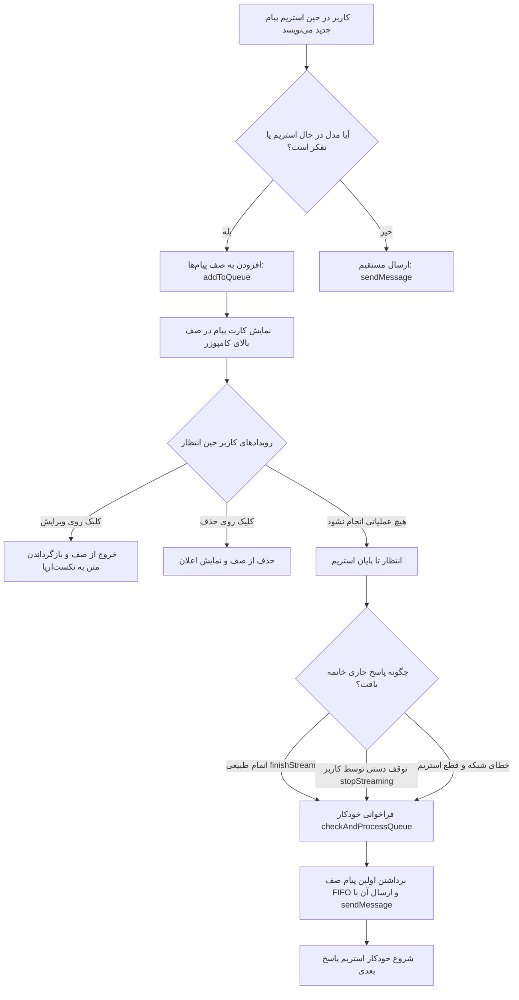

# مستندات فنی و راهنمای پیاده‌سازی قابلیت پیام در صف (Message Queue Feature)

این سند به تشریح کامل معماری، نحوه عملکرد، چرخه حیات و جزئیات پیاده‌سازی **قابلیت پیام در صف (Message Queue)** در پلتفرم پروا می‌پردازد.

---

## ۱. صورت مسئله و انگیزه پیاده‌سازی

در سامانه‌های گفتگوی هوش مصنوعی استاندارد (مشابه ChatGPT و Claude)، کاربر هنگام تولید پاسخ توسط هوش مصنوعی نباید مسدود شود. در پیاده‌سازی قبلی سامانه:
1. چنانچه مدل هوش مصنوعی در حال استریم پاسخ (`isStreaming`) یا در فاز استدلال و تفکر عمیق (`isThinking`) بود، دکمه ارسال غیرفعال می‌شد و فشردن کلید Enter هیچ واکنشی نشان نمی‌داد یا با پیام خطا («امکان ارسال پیام جدید وجود ندارد») کاربر را متوقف می‌کرد.
2. کاربر برای ارسال سوال یا درخواست بعدی خود مجبور بود منتظر بماند تا پاسخ قبلی کاملاً تمام شود. اگر ایده‌ای به ذهن کاربر می‌رسید، مجبور بود آن را جای دیگری یادداشت کند یا پس از اتمام استریم دستی اقدام به ارسال کند.

### هدف:
پیاده‌سازی یک صف هوشمند، منعطف و کاملاً خودکار برای پیام‌ها به نحوی که:
* کاربر در حین دریافت پاسخ بتواند بدون هیچ مانعی پیام متنی بعدی خود را تایپ کرده یا فایل پیوست کند.
* با فشردن Enter یا دکمه «افزودن به صف»، پیام در صف ارسال قرار گیرد.
* کارت زیبای پیام در صف با امکان **ویرایش (Edit)** و **حذف (Delete)** نمایش داده شود.
* به محض اتمام پاسخ جاری (یا توقف دستی توسط کاربر با دکمه Stop)، پیام در صف به صورت کاملاً خودکار و بدون نیاز به دخالت کاربر ارسال شده و پاسخ بعدی استریم شود.

---

## ۲. معماری داده‌ها و چرخه حیات پیام در صف



---

## ۳. تغییرات انجام‌شده در لایه داده و استور (`frontend/src/stores/chat.ts`)

### ۳.۱. تعریف ساختار `QueuedMessage`
اینترفیس اختصاصی `QueuedMessage` به فایل تایپ‌ها (`frontend/src/types/index.ts`) اضافه شد:

```typescript
export interface QueuedMessage {
  id: string
  conversationId: string
  content: string
  fileIds?: string[]
  files?: FileAttachmentItem[]
  options?: {
    useWebSearch?: boolean
    useThinking?: boolean
  }
  createdAt: string
}
```

### ۳.۲. مدیریت صف‌های مستقل به ازای هر گفتگو
برای جلوگیری از تداخل صف‌ها بین چت‌های مختلف، صف در قالب یک مپ ری‌اکتیو بر اساس `conversationId` نگهداری می‌شود:

```typescript
const messageQueue = ref<Map<string, QueuedMessage[]>>(new Map())
```

متدهای مدیریت صف افزوده شده:
* **`addToQueue(content, files, options, convId)`**: آیتم جدیدی با شناسه منحصربه‌فرد، متادیتای فایل‌ها و گزینه‌های جستجوی وب و تفکر به صف انتهای گفتگوی مدنظر اضافه می‌کند.
* **`removeFromQueue(queueId, convId)`**: پیام مشخصی را از صف گفتگوی مربوطه حذف می‌نماید.
* **`clearQueue(convId)`**: کل صف گفتگوی مربوطه را پاکسازی می‌کند.
* **`currentQueuedMessages`**: یک `computed` هوشمند که همیشه پیام‌های در صفِ گفتگوی فعال فعلی را به فرانت‌انداز برمی‌گرداند.
* **`processNextInQueue(convId)`**: اولین پیام صف (رویکرد FIFO) را خارج کرده و متد `sendMessage` را با محتوا، فایل‌ها و تنظیمات آن فراخوانی می‌کند.

### ۳.۳. اتصال به پایان جریان (`finishStream`) و دکمه توقف (`stopStreaming`)
در تابع `finishStream`:
```typescript
convStreamStates.value.set(convId, { ...s })
void authStore.refreshQuota()
setTimeout(() => {
  checkAndProcessQueue(convId)
}, 50)
```
با این مکانیزم، چه جریان با دریافت آخرین توکن به پایان برسد و چه کاربر دکمه توقف (`stopStreaming`) را بزند، سامانه بلافاصله پیام در صف را برداشته و فرآیند تولید پاسخ به پیام بعدی را آغاز می‌کند.

### ۳.۴. مهاجرت شناسه صف در چت‌های جدید
هنگامی که کاربری در یک گفتگوی تازه (با شناسه موقت فرانت‌اندی `c-...`) پیامی می‌فرستد و سرور شناسه قطعی به گفتگو می‌دهد، صف پیام‌ها نیز به طور خودکار به شناسه واقعی جدید منتقل می‌شود:
```typescript
const oldMsgQueue = messageQueue.value.get(convId)
if (oldMsgQueue) {
  messageQueue.value.delete(convId)
  messageQueue.value.set(created.id, oldMsgQueue)
}
```

---

## ۴. تغییرات رابط کاربری و کامپوننت آهنگساز (`ChatComposer.vue`)

### ۴.۱. آزاد شدن ورودی و کلید Enter هنگام تولید پاسخ
قبلاً در متدهای `handleKeydown` و `handleSubmit` شرط `if (isGenerating.value) return` مانع از عملکرد کاربر می‌شد. این محدودیت حذف شد:
* اگر `isGenerating.value` **نباشد**: پیام به طور معمول ارسال می‌شود.
* اگر `isGenerating.value` **باشد**: پیام به صف ارسال اضافه می‌شود (`chatStore.addToQueue`) و کادر تکست‌اریا خالی می‌شود تا فضا برای ادامه‌ی کار آزاد گردد.

### ۴.۲. کارت نمایش پیام در صف (Queued Message Card)
درست بالای کادر کامپوزر (`composer-card`)، کارتی زیبا با مشخصات زیر تعبیه شد:
1. **نشانگر وضعیت متحرک (Pulsating Queue Dot)**: یک دایره بنفش‌رنگ با انیمیشن پالس‌زننده که حس زنده بودن صف را منتقل می‌کند.
2. **برچسب و شمارنده پیام**: متن «پیام در صف ارسال» و در صورت وجود بیش از ۱ پیام، نمایش ترتیب آن (مثلاً `(۱ از ۲)`).
3. **پیش‌نمایش محتوا**: نمایش متن پیام با تشخیص بلادرنگ جهت راست‌به‌چپ یا چپ‌به‌راست (`rtl`/`ltr`).
4. **برچسب‌های فایل و قابلیت‌ها**: در صورت داشتن فایل پیوست یا فعال بودن جستجوی وب (`🌐`) یا تفکر عمیق (`🧠`)، نشانگرهای مربوطه نمایش داده می‌شوند.
5. **دکمه ویرایش (ویرایش / Edit)**:
   - پیام را از صف خارج می‌کند.
   - متن را مستقیماً به داخل تکست‌اریا برمی‌گرداند.
   - فایل‌های پیوست و فلگ‌های وب/تفکر را بازیابی می‌کند.
   - فوکوس کیبورد را روی تکست‌اریا قرار می‌دهد.
6. **دکمه حذف (حذف / Delete)**: پیام را با یک کلیک از صف خارج کرده و اعلان `پیام از صف حذف شد` را نمایش می‌دهد.

### ۴.۳. دکمه دوگانه هوشمند (Dual Action Buttons)
هنگامی که پاسخی در حال استریم است (`isGenerating`):
* اگر کاربر هنوز چیزی در تکست‌اریا ننوشته باشد: دکمه توقف (`.btn-stop` با آیکون مربع) نمایش داده می‌شود.
* به محض اینکه کاربر کلمه‌ای تایپ کند: علاوه بر دکمه توقف، دکمه شیک **«افزودن به صف ارسال» (`.btn-queue`)** در کنار آن ظاهر می‌شود تا کاربر بتواند با یک کلیک یا با زدن Enter پیام را به صف اضافه کند.

---

## ۵. آزمون‌های خودکار و نتایج صحت‌سنجی (Verification)

یک مجموعه آزمون جامع در فایل [`frontend/tests/MessageQueue.spec.ts`](file:///d:/codeless_final/frontend/tests/MessageQueue.spec.ts) ایجاد و با فریمورک Vitest اجرا شد:

| شماره آزمون | سناریو | نتیجه |
|---|---|---|
| ۱ | تایپ و ثبت پیام حین استریم و اضافه شدن پیام به صف همراه با نمایش کارت در DOM | ✅ موفق (Passed) |
| ۲ | کلیک روی دکمه «ویرایش» پیام در صف، حذف از صف و بازگشت متن و تنظیمات به تکست‌اریا | ✅ موفق (Passed) |
| ۳ | کلیک روی دکمه «حذف» پیام در صف، پاکسازی از صف و پنهان شدن کارت | ✅ موفق (Passed) |
| ۴ | اتمام استریم پاسخ فعلی (`finishStream`) و ارسال و استریم خودکار پیام در صف | ✅ موفق (Passed) |
| ۵ | توقف دستی پاسخ فعلی با دکمه Stop (`stopStreaming`) و ارسال فوری پیام در صف | ✅ موفق (Passed) |
| ۶ | بررسی ترتیب خروج پیام‌ها در صف چندگانه طبق اصل FIFO (نخستین ورودی، نخستین خروجی) | ✅ موفق (Passed) |
| ۷ | ایزولاسیون کامل گفتگوها (عدم نشت پیام‌های صف گفتگوی A به گفتگوی B) | ✅ موفق (Passed) |
| ۸ | تمام ۱۱ تست پیشین `ChatComposer.spec.ts` بدون تغییر و با سازگاری کامل | ✅ موفق (Passed) |
| ۹ | اجرای بیلد نهایی فرانت‌اند (`npm run build`) | ✅ موفق (Passed با 0 خطا) |

---

## ۶. جمع‌بندی فایل‌های تغییریافته

1. [`frontend/src/types/index.ts`](file:///d:/codeless_final/frontend/src/types/index.ts): افزودن اینترفیس `QueuedMessage`.
2. [`frontend/src/stores/chat.ts`](file:///d:/codeless_final/frontend/src/stores/chat.ts): پیاده‌سازی متدهای صف‌بندی، دی‌کیو خودکار، مهاجرت شناسه‌ها و اتصال به `finishStream` و `stopStreaming`.
3. [`frontend/src/components/chat/ChatComposer.vue`](file:///d:/codeless_final/frontend/src/components/chat/ChatComposer.vue): باز کردن امکان تایپ و ارسال در حالت استریم، نمایش کارت صف با ویرایش و لغو، و افزودن دکمه `.btn-queue`.
4. [`frontend/tests/MessageQueue.spec.ts`](file:///d:/codeless_final/frontend/tests/MessageQueue.spec.ts): ایجاد تست‌های اختصاصی قابلیت صف پیام.
5. [`docs/wiki/features.md`](file:///d:/codeless_final/docs/wiki/features.md) و [`CHANGELOG.md`](file:///d:/codeless_final/CHANGELOG.md): به‌روزرسانی مستندات ویکی و تاریخچه نسخه‌ها.
