# راهنمای جامع تراکنش‌های دیتابیس (Transactions) و معماری سیستم لاگ (System & Audit Logs)

این مستند تشریح می‌کند که **تراکنش‌های دیتابیس (Transactions) در کجای پروژه قرار دارند، چه ریسک‌هایی را مهار می‌کنند، و لاگ‌های سیستم و ممیزی (Audit Logs) کجا و چگونه ذخیره می‌شوند و آیا ناهمگام (Async) هستند یا خیر.**

---

## ۱. تراکنش‌های دیتابیس (Database Transactions & ACID)

### الف) چرا تراکنش‌ها در پروژه حیاتی هستند؟
در یک سامانه چت چندمدلی با امکانات مالی، سهمیه‌بندی، و توکن‌های احراز هویت، بروز خطای شبکه یا ارسال همزمان درخواست‌ها (Race Condition) می‌تواند منجر به تناقضات جبران‌ناپذیر شود. تراکنش‌های پایگاه داده بر اساس اصول **ACID** این مشکلات را مهار می‌کنند:
- **Atomicity (همه‌یا‌هیچ):** تمام عملیات‌های دیتابیسیِ درون یک بلاک یا همگی با موفقیت ثبت می‌شوند یا در صورت بروز کوچک‌ترین خطا، کل تغییرات به حالت قبل برمی‌گردند (Rollback).
- **Consistency (سازگاری):** دیتابیس همیشه از یک وضعیت معتبر به وضعیت معتبر دیگری منتقل می‌شود و محدودیت‌های یکتایی یا کلید خارجی نقض نمی‌شوند.
- **Isolation (جداسازی):** تراکنش‌های موازی روی رکوردهای مشترک با قفل‌گذاری مناسب از دید یکدیگر ایزوله می‌شوند تا داده‌های کثیف خوانده نشود.
- **Durability (پایداری):** پس از ثبت تراکنش (Commit)، داده‌ها حتی در صورت خاموش شدن ناگهانی سرور ماندگار می‌مانند.

---

### ب) محل دقیق تک‌تک تراکنش‌های پروژه در کد بک‌اند

در پروژه **CODELESS / PARVA**، نقاط حساس مالی، احراز هویت و اشتراک‌ها با تراکنش محافظت شده‌اند:

```
backend/src/
├── modules/
│   ├── subscriptions/
│   │   └── subscriptions.service.ts   ← [تراکنش ۱] تخصیص و ارتقای اشتراک کاربر (assignPlanToUser)
│   ├── auth/
│   │   └── auth.service.ts            ← [تراکنش ۲] چرخش امن توکن رفرش (refresh token rotation)
│   └── payments/
│       ├── payments.service.ts        ← [تراکنش ۳] وریفای پرداخت با قفل بدبینانه (verifyPayment)
│       └── coupons.service.ts         ← [تراکنش ۴] ثبت اتمیک مصرف کوپن تخفیف (recordUsage)
```

#### ۱. تخصیص و تغییر پلن اشتراک کاربر (`SubscriptionsService.assignPlanToUser`)
- **فایل:** `backend/src/modules/subscriptions/subscriptions.service.ts`
- **ریسک مهارشده:** هنگامی که کاربر پلن جدیدی خریداری می‌کند یا ادمین پلن او را تغییر می‌دهد، سیستم باید اشتراک‌های فعال قبلی را منقضی یا باطل (`superseded` یا `expired`) کند و اشتراک جدید را در وضعیت `active` ایجاد نماید. اگر این دو عملیات بدون تراکنش انجام شوند، در صورت قطع شبکه بین این دو کوئری، کاربر یا بدون اشتراک رها می‌شود یا دو اشتراک همزمان فعال با سهمیه‌های متناقض پیدا می‌کند.
- **پیاده‌سازی:**
  ```typescript
  return await this.dataSource.transaction(async (manager) => {
    // ۱. منقضی کردن اشتراک‌های فعال قبلی در تراکنش
    await manager.update(
      Subscription,
      { userId, status: SubscriptionStatus.ACTIVE },
      { status: SubscriptionStatus.EXPIRED, canceledAt: new Date() },
    );

    // ۲. ایجاد و ذخیره اشتراک جدید در همان تراکنش
    const sub = manager.create(Subscription, { ... });
    return await manager.save(sub);
  });
  ```

#### ۲. چرخش توکن‌های رفرش و مقابله با Replay Attack (`AuthService.refresh`)
- **فایل:** `backend/src/modules/auth/auth.service.ts`
- **ریسک مهارشده:** طبق استاندارد Refresh Token Rotation (RTR)، به ازای هر بار دریافت Access Token جدید، توکن رفرش قدیمی باید باطل (`isRevoked = true`) شده و توکن هش‌شده جدید ذخیره شود. اگر کلاینت در اثر تاخیر شبکه دو بار متوالی درخواست رفرش بفرستد، بدون تراکنش اتمیک احتمال دارد یک توکن دوبار مصرف شود یا کاربر به اشتباه مشمول خطای سرقت توکن گردد.
- **پیاده‌سازی:**
  ```typescript
  return await this.dataSource.transaction(async (manager) => {
    // ۱. باطل‌سازی توکن قبلی در تراکنش
    await manager.update(RefreshToken, { id: storedToken.id }, { isRevoked: true });

    // ۲. درج توکن رفرش هش‌شده جدید در همان تراکنش
    const newRecord = manager.create(RefreshToken, { ... });
    await manager.save(newRecord);
    return { accessToken, refreshToken: newRawToken };
  });
  ```

#### ۳. تایید نهایی تراکنش مالی با قفل بدبینانه (`PaymentsService.verifyPayment`)
- **فایل:** `backend/src/modules/payments/payments.service.ts`
- **ریسک مهارشده:** در درگاه‌های پرداخت بانکی (مانند زرین‌پال)، وب‌هوک‌های تایید ممکن است به دلیل تلاش مجدد درگاه به صورت همزمان دوبار دریافت شوند (Double-Spending). سیستم با اعمال **قفل بدبینانه (`pessimistic_write`)** روی سطر پرداخت درون یک تراکنش، تضمین می‌کند که فقط اولین درخواست وضعیت را به `COMPLETED` تغییر دهد و اشتراک را فعال سازد، و درخواست‌های موازی معطل مانده و متوجه انجام شدن قبلی پرداخت شوند.
- **پیاده‌سازی:**
  ```typescript
  return await this.dataSource.transaction(async (manager) => {
    const payment = await manager
      .createQueryBuilder(Payment, 'p')
      .where('p.authority = :authority', { authority })
      .setLock('pessimistic_write')
      .getOne();

    if (payment.status === PaymentStatus.COMPLETED) {
      return payment; // جلوگیری از شارژ مجدد
    }
    // تغییر وضعیت و فعال‌سازی اشتراک
  });
  ```

#### ۴. ثبت اتمیک مصرف کوپن‌های تخفیف (`CouponsService.recordUsage`)
- **فایل:** `backend/src/modules/payments/coupons.service.ts`
- **ریسک مهارشده:** جلوگیری از مصرف کوپن تخفیف بیش از سقف مجاز (`usageLimit`) در اثر درخواست‌های همزمان کاربران در ثانیه‌های پایانی یک کمپین تخفیف.

---

## ۲. معماری ذخیره‌سازی لاگ‌ها (Where & How Logs Are Stored)

پلتفرم از یک معماری تفکیک‌شده دوگانه بهره می‌برد تا از **حجیم‌شدن پایگاه داده PostgreSQL** جلوگیری کند و در عین حال انطباق کامل با استانداردهای امنیت و ردیابی را تضمین نماید:

```
                              [ورودی درخواست‌ها و رویدادهای بک‌اند]
                                                │
                 ┌──────────────────────────────┴──────────────────────────────┐
                 ▼                                                             ▼
    [لاگ‌های سیستمی و عیب‌یابی]                                     [لاگ‌های ممیزی و امنیتی]
         (System Logs)                                                  (Audit Logs)
                 │                                                             │
        ┌────────┴────────┐                                                    │
        ▼                 ▼                                                    ▼
 [فایل‌های محلی]     [SigNoz APM]                                     [PostgreSQL Database]
  backend/logs/      ClickHouse DB                                     جدول audit_logs
  - app-*.log        پروتکل OTLP /v1/logs                              (صرفاً تغییرات وضعیت،
  - error-*.log      نگهداری تله‌متری پرسرعت                            احراز هویت و خطاها)
```

### الف) لاگ‌های سیستم و اپلیکیشن (System & Application Logs)
- **محتوا:** تمام خروجی‌های کنسول، پیام‌های دیباگ فریمورک NestJS، درخواست‌های عبوری، هشدارهای بیزینس و ارورهای غیرمنتظره همراه با Stack Trace.
- **محل ذخیره‌سازی:**
  1. **فایل‌های چرخشی روزانه در سرور (`backend/logs/`):**
     - `backend/logs/app-YYYY-MM-DD.log`: کلیه لاگ‌های عمومی، دیباگ، اطلاعاتی و لاگ‌های سطح HTTP.
     - `backend/logs/error-YYYY-MM-DD.log`: فایل اختصاصی برای لاگ‌های سطح `ERROR` و `FATAL` جهت بررسی سریع خرابی‌ها.
  2. **سرور مانیتورینگ SigNoz (دیتابیس فوق‌سریع ClickHouse):**
     - ۱۰۰٪ لاگ‌های سیستم از طریق پروتکل رسمی OpenTelemetry OTLP به اندپوینت `/v1/logs` در SigNoz ارسال می‌شوند.
     - دیتابیس ClickHouse به دلیل ساختار ستونی و فشرده‌سازی بسیار بالا، حجم انبوه لاگ‌ها را بدون کوچک‌ترین افت سرعت نگهداری می‌کند و دارای سیاست‌های انقضای خودکار (TTL Retention) است.
     - در پنل ادمین، دکمه‌ای اختصاصی با عنوان **«لاگ‌های زنده در SigNoz»** تعبیه شده که با یک کلیک، جریان زنده لاگ‌ها (Live Tail) را در داشبورد سیگنوز باز می‌کند.
- **امنیت داده‌ها (Redaction):**
  - کلیه فیلدهای حساس شامل `password`, `token`, `authorization`, `cookie`, `secret`, `apiKey` قبل از نوشتن در فایل یا ارسال به سیگنوز با متن `[REDACTED]` جایگزین می‌شوند تا هیچ اطلاعات هویتی یا محرمانه‌ای نشت نکند.

### ب) لاگ‌های ممیزی و امنیتی (Audit Logs)
- **محتوا:** اسناد حقوقی و نظارتی تغییرات مهم سیستم: "چه کسی، در چه زمانی، روی چه موجودیتی، چه تغییری ایجاد کرد؟"
- **محل ذخیره‌سازی:** منحصراً در **پایگاه داده PostgreSQL در جدول `audit_logs`**.
- **جلوگیری از انباشت غیرضروری داده در دیتابیس:**
  - درخواست‌های معمولی و خواندنی (`GET` با کد وضعیت زیر ۴۰۰) به هیچ عنوان در دیتابیس ذخیره **نمی‌شوند**.
  - جدول `audit_logs` فقط میزبان موارد زیر است:
    1. تمام عملیات‌های تغییر وضعیت سیستم (`POST`, `PUT`, `PATCH`, `DELETE`).
    2. رویدادهای امنیتی و احراز هویت (لاگین، ثبت‌نام، رفرش توکن، لاگ‌اوت).
    3. رویدادهای مالی و ارتقای اشتراک.
    4. **کلیه خطاهای سیستم (`statusCode >= 400`)** حتی اگر از نوع `GET` باشند (جهت ثبت تلاش‌های ناموفق و ردیابی باگ‌ها).
- **ستون‌های جدول `audit_logs`:**
  - `id`: شناسه یکتای لاگ (UUID).
  - `traceId` و `spanId`: کدهای استاندارد ردگیری W3C جهت اتصال ۱-کلیکی لاگ دیتابیس به تریس مربوطه در سیگنوز.
  - `actorId`, `actorEmail`, `actorName`, `actorType`: مشخصات دقیق کاربری که این اقدام را انجام داده است.
  - `action`, `entityType`, `entityId`: عنوان عملیات و شناسه رکوردی که تغییر کرده است.
  - `method`, `path`, `statusCode`, `durationMs`: جزئیات پروتکل HTTP و زمان اجرای پردازش به میلی‌ثانیه.
  - `metadata`: اطلاعات مکمل درخواست که پیش از ذخیره کاملاً پالایش و فیلتر شده‌اند.

---

## ۳. بررسی ماهیت ناهمگام (Async vs Sync) در ثبت لاگ‌ها

یکی از سوالات کلیدی معماری این است که: **«آیا لاگ‌ها و Audit Logها به صورت Async هستند یا خیر؟»**

| نوع لاگ | شیوه ذخیره‌سازی | همگام/ناهمگام (Async/Sync) | تاثیر بر تاخیر (Latency) درخواست کاربر | استقلال از تراکنش دیتابیس (Lifecycle) |
|---|---|---|---|---|
| **لاگ‌های فایل (`backend/logs/`)** | فایل دیسک | **کاملاً ناهمگام (Async)** | **صفر** (از طریق `fs.promises.appendFile`) | مستقل |
| **لاگ‌های سیگنوز (OTLP /v1/logs)** | شبکه HTTP به SigNoz | **کاملاً ناهمگام (Async Fire-and-Forget)** | **صفر** (اجرای موازی پس‌زمینه با هندلینگ خطا) | مستقل |
| **لاگ‌های ممیزی دیتابیس (`audit_logs`)** | جدول PostgreSQL | **ناهمگام (Async)** | **حداقل** (ذخیره پس از ارسال پاسخ به کلاینت) | **کاملاً مستقل از تراکنش اصلی بیزینس** |

### چرایی استقلال چرخه حیات Audit Log از تراکنش‌های بیزینس (Autonomous Lifecycle):
> **اصل طلایی مهندسی:** لاگ ممیزی نباید عضوی از تراکنش دیتابیس بیزینس باشد!

اگر لاگ ممیزی را درون تراکنش اصلی دیتابیس (مثلاً خرید اشتراک یا تغییر پسورد) قرار دهیم:
1. اگر تراکنش بیزینس شکست بخورد و Rollback شود، رکورد Audit Log مربوط به "شکست تراکنش" نیز همراه آن Rollback و پاک می‌شود! در این حالت ادمین سیستم هرگز نخواهد فهمید چه کسی تلاش ناموفقی برای ورود یا خرید داشته است.
2. اگر نوشتن لاگ ممیزی به هر دلیلی با خطای دیتابیس مواجه شود، نباید تراکنش صحیح و پرداخت موفق کاربر را Rollback کند.

به همین دلیل:
- متد `auditService.log` به صورت یک فرآیند ناهمگام (`async`) و با مدیریت خطای مستقل (`catch`) فراخوانی می‌شود.
- حتی اگر نوشتن لاگ ممیزی با مشکل مواجه شود، درخواست کلاینت و تراکنش اصلی بیزینس با کمال صحت به پایان می‌رسند و خطای لاگ در فایل خطاهای سیستم ثبت می‌گردد.

---

---

## ۴. چرخه گام‌به‌گام تعامل Audit Log با تراکنش‌ها (Step-by-Step Execution Flow)

برای درک دقیق اینکه در زمان وقوع یک تراکنش (مثلاً پرداخت بانکی یا تغییر اشتراک) چه اتفاقاتی در کد می‌افتد، چرخه زیر پیاده‌سازی شده است:

```mermaid
sequenceDiagram
    autonumber
    actor User as کاربر / کلاینت
    participant MW as Middleware (TraceContext)
    participant Ctrl as Controller & Interceptor
    participant Svc as Business Service
    participant DB as PostgreSQL (Business Tables)
    participant Audit as AuditService (audit_logs)
    participant OTel as AppLogger & SigNoz (ClickHouse)

    User->>MW: ارسال درخواست تراکنشی (مثلاً وریفای پرداخت)
    MW->>MW: تولید traceId و spanId یکتای W3C در AsyncLocalStorage
    MW->>Ctrl: هدایت درخواست به کنترلر
    Ctrl->>Svc: فراخوانی متد تراکنشی
    
    rect rgb(30, 41, 59)
        note over Svc,DB: [محدوده تراکنش اتمیک دیتابیس - dataSource.transaction]
        Svc->>DB: باز کردن تراکنش دیتابیس (BEGIN)
        Svc->>DB: اعمال قفل بدبینانه (SELECT ... FOR UPDATE)
        alt حالت ۱: پرداخت موفقیت‌آمیز
            Svc->>DB: ثبت پرداخت، کسر کوپن و فعال‌سازی اشتراک
            Svc->>DB: تثبیت تراکنش (COMMIT)
        else حالت ۲: پرداخت ناموفق یا انصراف کاربر
            Svc->>DB: علامت‌گذاری لغو یا برگشت تغییرات (ROLLBACK)
        end
    end

    note over Svc,Audit: [مرحله ثبت مستقل ممیزی - خارج از تراکنش بیزینس]
    Svc->>Audit: فراخوانی log() با نتیجه تراکنش (verified یا failed)
    Audit->>Audit: پالایش و ماسک اطلاعات حساس (رمز، توکن، شماره کارت)
    Audit->>DB: درج اتمیک در جدول audit_logs همراه با traceId
    
    par استریم موازی و غیرمسدودکننده
        Ctrl->>OTel: ارسال لاگ به فایل روزانه app-*.log
        Ctrl->>OTel: استریم OTLP به SigNoz (/v1/logs)
    and بازگشت پاسخ به کاربر
        Ctrl->>User: ارسال پاسخ نهایی HTTP
    end
```



### شرح تفصیلی گام‌های بالا:
1. **گام ۱ - ایجاد زمینه ردگیری (Trace Context):**
   - با ورود درخواست به سرور، `TraceContextMiddleware` یک `traceId` یکتای ۳۲ رقمی بر اساس استاندارد W3C ایجاد می‌کند. این شناسه از طریق `AsyncLocalStorage` در کل نخ پردازشی در دسترس است.
2. **گام ۲ - ورود به تراکنش اتمیک بیزینس (`dataSource.transaction`):**
   - سرویس بیزینس (مثلاً `PaymentsService`) یک بلاک تراکنش باز می‌کند.
   - برای جلوگیری از خطرات همزمانی (Race Condition و Double-Spending)، سطر مورد نظر با قفل بدبینانه (`pessimistic_write`) قفل می‌شود.
3. **گام ۳ - تعیین تکلیف تراکنش (Commit یا Rollback):**
   - **در صورت موفقیت:** داده‌ها آپدیت شده و تراکنش `COMMIT` می‌شود.
   - **در صورت شکست یا انصراف:** تغییرات به حالت قبل برمی‌گردند (`ROLLBACK`).
   - قفل دیتابیس در هر دو حالت بلافاصله آزاد می‌شود تا جدول بیهوده قفل نماند.
4. **گام ۴ - ثبت مستقل و ایمن در `audit_logs`:**
   - پس از بسته شدن تراکنش اصلی، `auditService.log` فراخوانی می‌شود.
   - اگر تراکنش موفق بوده باشد، لاگ `payment.verified` و اگر شکست خورده باشد، لاگ `payment.failed` ثبت می‌شود.
   - تابع `sanitizeAuditData` داده‌های محرمانه را با `[REDACTED]` ماسک می‌کند.
    - دستور `INSERT` به صورت اتمیک در جدول `audit_logs` اجرا می‌شود.
    - **مکانیزم نجات چندلایه در صورت بروز خطا (Fail-Safe & Fallback Logging):**
      اگر به هر دلیلی دیتابیس در ثبت لاگ ممیزی دچار خطای موقت شود (مثلاً قطعی اتصال به PostgreSQL یا خطای دیسک)، بلاک `try/catch` خطای آن را مهار کرده و **کل پیلود ممیزی (Fallback Payload)** شامل نوع اقدام (`action`)، شناسه و ایمیل عامل (`actorId`, `actorEmail`)، موجودیت (`entityId`, `entityType`)، متادیتا و تغییرات پالایش‌شده را در لاگر سراسری ثبت می‌کند. این امر باعث می‌شود:
      ۱. لاگ ناموفق بلافاصله در فایل `backend/logs/error-YYYY-MM-DD.log` با تمام جزئیات نوشته شود.
      ۲. یک رویداد خطای سطح `ERROR` از طریق OTLP به SigNoz ارسال شود.
      ۳. ادمین حتی در صورت عدم ثبت در دیتابیس، در داشبورد SigNoz و فایل لاگ دیسک به داده‌های رویداد ممیزی دسترسی داشته باشد.
      ۴. تراکنش اصلی کاربر هرگز با شکست مواجه نشده و خرید یا نشست کاربر لغو نگردد.
5. **گام ۵ - استریم موازی و ارسال به SigNoz و فایل:**
   - به طور همزمان و کاملاً ناهمگام (Async)، لاگ این عملیات در فایل‌های سرور (`backend/logs/app-*.log`) نوشته شده و یک کپی از آن به سرور SigNoz مخابره می‌شود.
   - ادمین می‌تواند با کلیک روی دکمه «مشاهده در SigNoz»، تمام کوئری‌های SQL و لاگ‌های ریز تراکنش را به صورت زنده مشاهده کند.

---

## ۵. خلاصه و جمع‌بندی
1. **تراکنش‌های دیتابیس:** در ۴ نقطه حساس (تخصیص پلن، چرخش توکن‌های رفرش، وریفای پرداخت و ثبت مصرف کوپن) از طریق `dataSource.transaction` و قفل‌های دیتابیس پیاده شده‌اند تا از هرگونه Race Condition و ناهمخوانی داده جلوگیری شود.
2. **لاگ‌های سیستم:** در فایل‌های محلی و سرور SigNoz ذخیره می‌شوند و پایگاه داده PostgreSQL را اشغال نمی‌کنند.
3. **لاگ‌های ممیزی:** صرفاً رخدادهای حساس و تغییرات وضعیت را در جدول `audit_logs` ذخیره می‌کنند و از درخواست‌های عادی `GET` مجزا هستند.
4. **تعامل لاگ و تراکنش:** لاگ ممیزی بعد از پایان تراکنش بیزینس ثبت می‌شود تا شواهد خطا پاک نشوند و خطای لاگر هم پرداخت کاربر را خراب نکند.
5. **رفتار ناهمگام:** تمام فرآیندهای لاگینگ به صورت Async طراحی شده‌اند تا سیستم چت پروا بالاترین سرعت پاسخ‌دهی را به کاربران ارائه دهد.

